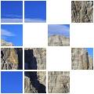
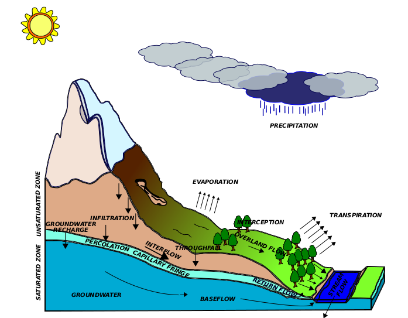
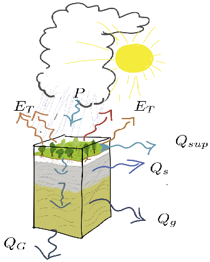
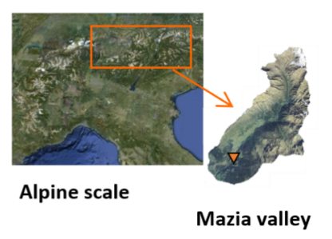
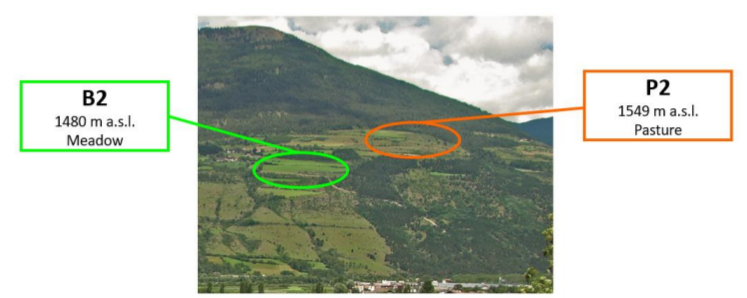
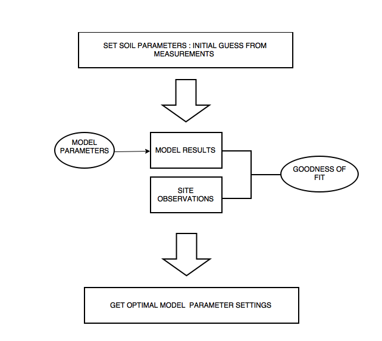

```{r global_options, include=FALSE}
knitr::opts_chunk$set(fig.pos = 'H')
```
## Header row {data-height=5}

###

<table style="width:100%">
<tr>
  <td><center><h3>
  **R use in Hydrology: an example with R and the hydrological model GEOtop**
  </h3></center></td>
 <td rowspan="2">
  </img>
  </td> 
   <td rowspan="2">
  </img>
  </td> 
  </td> 
   <td rowspan="2">
  </img>
  </td> 
  </td> 
   <td rowspan="2">
  </img>
  </td> 
  </td> 
   <td rowspan="2">
  </img>
  </td> 
</tr>
<tr><td><center>
  **Emanuele Cordano(1),Giacomo Bertoldi(2),Samuel Senoner(3)**
</center></td></tr>
<tr><td><center>
  (1) Rendena100, Engineering and Consultancy sole proprietorship, Tione di Trento, Italy, https://www.rendena100.eu , emanuele.cordano@rendena100.eu,  (2) EURAC Research, Institute for Alpine Environment, Bolzano, Italy (3) EURAC Research, ICT Department, Bolzano, Italy 4 
  </center></td>
</tr>
</table> 

<hr>

**Abstract** 
Eco-hydrological models are increasingly used in the contexts of hydrology, ecology, precision agriculture for a detailed description of the water cycle at various scales: local scale, an hillslope or a watershed. However, with increasing computing power and observations available, bigger and bigger amount of raw data are produced. Therefore the need to develop flexible and user-oriented interfaces to visualize multiple outputs, perform sensitivity analyzes and compare against observations emerges.
This work presents two R open-source packages: **geotopbricks** and **geotopOptim2**. They offer an I/0 interface and R visualization tools the GEOtop hydrological distributed model (http://geotopmodel.github.io/geotop/), which solves water mass and energy budget equations
to describe water cycle in the Earth´s critical zone.
The package *geotopbricks* (https://github.com/ecor/geotopbricks and https://CRAN.R-project.org/package=geotopbricks ) is able to to read the GEOtop I/O data of the model. The package *geotopOptim2* (https://github.com/EURAC-Ecohydro/geotopOptim2) calling the **hydroPSO** (https://CRAN.R-project.org/package=hydroPSO) package can be used for model calibration against observations. Further details and complete R package dependencies are listed in *geotopOtim2* description file.  As a demonstration example, an analysis of modeled and observed soil moisture time series in some alpine agricultural sites (https://github.com/EURAC-Ecohydro/MonaLisa) are presented.


## Body row {data-height=80}
### **GEOtop Hydrological Model**

 **Background**

Hydrology is the scientific study of the movement, distribution, and quality of water on Earth and other planets, including the water cycle, water resources and environmental watershed sustainability (Wikipedia).
Hydrological models are solvers of the differantial equations of water flows and water thermodymanics in the Earth associated to heat transfers between Earth and the low atmosphere. They are a simplification of a real-world system
useful to understand, predict, manage water resources. 
”integrated”
<center>
{width=50%}
</center>
 **GEOtop Hydrological Model**

[GEOtop](http://geotopmodel.github.io/geotop/) (Endrizzi et al, 2014 and references therein) is a distributed model of the mass and energy balance of the hydrological cycle. GEOtop is applicable to simulations in continuum in small or relatively large montain catchments. GEOtop deals with the effects of topography on the interaction between energy balance and hydrological cycle (water, glacier and snow) with peculiar solutions. It solves water water dynamics in a watershed described. Its input data consists on meteorological forcing time series (precipitation (P), air temperature and humidy, wind velocity, solar radiation, etc...) and spatially gridded coverage datasets like topography, land use and soil type. For each cell of the domani GEOtop returnd evapotransiration (ET), soil water contant, soil water pressure and surface/subsurface water fluxes (Q). For more detailed analyis GEOtop can works at a local scale in a one-dimensional vertical domain (**Soil column**). 

<center>
{width=15%}
{width=70%}

</center>


A GEOtop simulation is organized in a set of files within a directory.
This directory contains: **input files** (meteorological forcings,
topography, land-use, soil-type maps, initial conditions); **target
information** (which results are requested) ; **observations**. All
these information are written in a file called `geotop.inpts`, which is
a list of **keyword-value** pairs:


```
InitDateDDMMYYYYhhmm    =   09/04/2014 18:00  
EndDateDDMMYYYYhhmm     =   01/01/2016 00:00 
[...] 
MeteoFile               =   "meteoB2_irr" 
PointOutputFile         =   "tabs/point" 
```

**GEOtop model setup: a test case**

GOtop is applied to estimate soil water content in two soil columns below  two hydro-meteorological stations (B2 and P2) located in Val Mazia/Match, Malles Venosta/Mals Vinschgau, in South Tyrol, Italy (LOng Term Reasearch Ecological Area, [http://lter.eurac.edu/en]).

<center>
{width=40%}
{width=40%}
</center>


```{r,echo=FALSE,eval=TRUE}
### METEO_DATA
library(geotopbricks)
library(ggplot2)
library(reshape2)

wpath_B2 <- "resources/simulation/Matsch_B2_Ref_007" 
meteo_B2  <- get.geotop.inpts.keyword.value("MeteoFile",wpath=wpath_B2,data.frame=TRUE)
ipreckey <- get.geotop.inpts.keyword.value("HeaderIPrec",wpath=wpath_B2)
## WARNING: in this case meteo data has an hourly frequency. 
meteo_B2_aggr <-aggregate(x=meteo_B2,by=as.Date(index(meteo_B2)),FUN=mean,na.rm=TRUE)
meteo_B2_aggr$prec <- meteo_B2_aggr[,ipreckey]*24
meteo_B2_aggr_time <-  index(meteo_B2_aggr)
meteo_B2_aggr <- as.data.frame(meteo_B2_aggr)
meteo_B2_aggr$time <- meteo_B2_aggr_time
meteo_B2_aggr$month <- as.character(meteo_B2_aggr$time,format="%m-%Y")

meteo_B2_aggr <- meteo_B2_aggr[meteo_B2_aggr$month %in% c("08-2010","08-2011","08-2012","08-2013","08-2014"),]
valmin <- 1
meteo_B2_aggr_p <- meteo_B2_aggr[meteo_B2_aggr$prec>valmin,]
prec_Boxplot <- ggplot(meteo_B2_aggr_p, aes(x=as.factor(month), y=prec))+geom_boxplot()
prec_Boxplot <- prec_Boxplot+ggtitle("Daily Precipitation Depth in the rainy days")+ylab("Precipitation [mm]")+xlab("")+theme_bw()

##show(prec_Boxplot)

```

```{r,echo=FALSE,eval=TRUE}
monthlyprec <- tapply(X=meteo_B2_aggr$prec,INDEX=meteo_B2_aggr$month,FUN=sum)
xx <- names(monthlyprec)
prec_barplot <- ggplot(data=NULL, aes(x=xx, y=monthlyprec))+geom_bar(stat="identity")+theme_bw()
prec_barplot <- prec_barplot+ylab("Monthly Precipitation Depth [mm]")+xlab("")
```
```{r,echo=FALSE,eval=TRUE}
prec_ <- function(x,valmin=valmin) {length(which(x>=valmin))/length(x)}
nmonthlyprec <- tapply(X=meteo_B2_aggr$prec,INDEX=meteo_B2_aggr$month,FUN=prec_,valmin=valmin)
xx <- names(nmonthlyprec)
nprec_barplot <- ggplot(data=NULL, aes(x=xx, y=nmonthlyprec))+geom_bar(stat="identity")+theme_bw()
nprec_barplot <- nprec_barplot+ylab("Monthly Rainy Days [%]")+xlab("")
```
```{r,echo=FALSE,eval=TRUE,fig.show='hold',fig.align='center'}
multiplot <- function(..., plotlist=NULL, file, cols=1, layout=NULL) {
  library(grid)
  
  # Make a list from the ... arguments and plotlist
  plots <- c(list(...), plotlist)
  
  numPlots = length(plots)
  
  # If layout is NULL, then use 'cols' to determine layout
  if (is.null(layout)) {
    # Make the panel
    # ncol: Number of columns of plots
    # nrow: Number of rows needed, calculated from # of cols
    layout <- matrix(seq(1, cols * ceiling(numPlots/cols)),
                     ncol = cols, nrow = ceiling(numPlots/cols))
  }
  
  if (numPlots==1) {
    print(plots[[1]])
    
  } else {
    # Set up the page
    grid.newpage()
    pushViewport(viewport(layout = grid.layout(nrow(layout), ncol(layout))))
    
    # Make each plot, in the correct location
    for (i in 1:numPlots) {
      # Get the i,j matrix positions of the regions that contain this subplot
      matchidx <- as.data.frame(which(layout == i, arr.ind = TRUE))
      
      print(plots[[i]], vp = viewport(layout.pos.row = matchidx$row,
                                      layout.pos.col = matchidx$col))
    }
  }
}
```
A prelimiinary analysis consist on visualize soil moistore dynamics in August for B2 and P2. In these sites, the total monthly precipitation depth and the number of rainy days. In such way, the precipitation are aggragated *at a monthly scale*:
<center style="width:90%">
```{r,echo=FALSE,eval=TRUE}
multiplot(prec_barplot,nprec_barplot,cols=2)
```
</center>
### **geotopbricks**

The aim of **geotopbricks** is to bring all the data of a GEOtop simulaton into the powerful statistical
**R** environment by using the `keyword-value` syntax of `geotop.inpts`. Here is an example on how to extract soil water content (SWC) at a 18cm depth in two sites P2 and B2. The goal of the code lines below is to represent the distribution of soil water content in August per different years (e.g. from 2010 to 2014).
Firs of all, soil water values are imported in the R session: 
```{r,echo=TRUE}
library(geotopbricks) 
library(ggplot2)
library(reshape2)
## SET GEOTOP WORKING DIRECTORY
wpath_B2 <- "resources/simulation/Matsch_B2_Ref_007" 

## See  'get.geotop.geetop.inpts.keyword.value' 
## help(get.geotop.inpts.keyword.value,help_type="html")
###Getting soil water content (SWC)
###
SWC_B2  <- get.geotop.inpts.keyword.value("SoilLiqContentProfileFile",wpath=wpath_B2,data.frame=TRUE,
                                          ,date_field="Date12.DDMMYYYYhhmm.",tz="Etc/GMT-1",
                                          zlayer.formatter="z%04d")

wpath_P2 <- "resources/simulation/Matsch_P2_Ref_007" 
SWC_P2  <- get.geotop.inpts.keyword.value("SoilLiqContentProfileFile",wpath=wpath_P2,data.frame=TRUE,
                                          ,date_field="Date12.DDMMYYYYhhmm.",tz="Etc/GMT-1",
                                          zlayer.formatter="z%04d")
```
Then, values are daily aggregated:
```{r,echo=TRUE}
## Box Plot
time <- index(SWC_B2)
SWC_B2_18cm <- SWC_B2[,"z0018"]
SWC_P2_18cm <- SWC_P2[,"z0018"]
## Daily Aggregation
SWC_B2_18cm_aggr <-aggregate(x=SWC_B2_18cm,by=as.Date(index(SWC_B2)), FUN=median)
SWC_P2_18cm_aggr <-aggregate(x=SWC_P2_18cm,by=as.Date(index(SWC_P2)), FUN=median)
months <- as.character(index(SWC_B2_18cm_aggr),format="%m-%Y")
df <- data.frame(month=months,P2=as.vector(SWC_P2_18cm_aggr),B2=as.vector(SWC_B2_18cm_aggr))
dfp <- df[df$month %in% c("08-2010","08-2011","08-2012","08-2013","08-2014"),]
dfpm <- melt(dfp,id="month")

SWC_Boxplot <- ggplot(dfpm, aes(x=as.factor(month), y=value))+geom_boxplot()
SWC_Boxplot <- SWC_Boxplot+ggtitle("Box Plot: Daily Soil Water Content")+ylab("SWC")+xlab("")+theme_bw()+facet_grid(. ~ variable)
```   

Finally, the boxplots of daily soil water content in August for B2 and P2:
<center>
```{r,echo=FALSE,eval=TRUE}
show(SWC_Boxplot)
```
</center>
<center>
```{r,echo=FALSE,eval=TRUE}
show(prec_Boxplot)
```
</center>
The results show than B2 is able to hold more water than P2. This depends on soil and land properties. Compared with input precipiation results,soil water behaviour for the different months is related to precipitation amount (depth and number of rainy days). Interestingly, in August 2014 soil water content is higher than in August 2012,  in which precipitaion is higher. However, in August 2014 the daily precipitation distribution is the least wide with the lowest variability (interquantile range) and two extreme events. (Precipiation time series in B2 and P2 are equal due to their short distance!)

### **geotopOptim2**

The **geotopOptim2** package is a tool that allows to check the simulated results with the experimental observations in order to better estimate by calibration of the physical parameters (e.g. soil properties) that cannot be easily and directly measured and present high experimantal uncertainity.  In details, *geotopOptim2* is a package  enters a GEOtop simulation folder and calibarate some parameters (set by user) optimizing a Goodnes-of-Fit measure between point results and point and observations. It is based on *hydroGOF* and *hydroPSO* packages containing a **PSO** (Particle Swarm Optimization) algorithm.

<!--It is composed by a set of functions that calls dependency function and the user can work with all or some of these functions as it in his or her preferences. Before entering geotopOptim2, here is a  list of the main finctions: 

* **geotopExec** :  This function executes a simulation of GEOtop given a certain set of parameters:

```{r echo=FALSE,eval=FALSE}
  library(geotopOptim2)
  help(geotopExec,help_type="html")
  help(get.geotop.keyword.inpts.value,help_type = "html")
```
* **geotopLookUpTable**: It read the lookup table that can be inserted within a GEOtop point simulation according Read point output from GEOtop for verification of the model results: 
```{r echo=FALSE,eval=FALSE}
  
  help(geotopLookUpTable,help_type="html")
```
* **geotoGOF** : It is a wrapper for gof function, it calculates the goodness of fit index for the variables choosen in the data frame returned by geotopLookUpTable; it includes geotopExec and geotopLookukUpTale. Main arguments of geotopGOF are passed to geotopExec as main arguments. 
```{r echo=FALSE,eval=FALSE}
  
  help(geotoGOF,help_type="html")
  help(gof,help_type="gof")
```


* **geotopPSO** : It is a wrapper for 'hydroPSO::hydroPSO' function, it search the optimal goodness of fit index for the variables choosen in the data frame returned by 'geotopLookUpTable'.
```{r echo=TRUE,eval=FALSE}
  
  help(geotoPSO,help_type="html")
  help(pso,help_type="html")
  
```
The dependencies among the main function package functions are represented by the following graph:-->
<center>
```{r,fig.height=8, fig.width=6,echo=FALSE,results='hide',collapse=TRUE}
#!/usr/bin/env Rscript
# file appendSmetData.R
#
# This script creates a graph of the package function and thair main external depencies
#
# author: Emanuele Cordano on 09-09-2015

#This program is free software: you can redistribute it and/or modify
#it under the terms of the GNU General Public License as published by
#the Free Software Foundation, either version 3 of the License, or
#(at your option) any later version.
#
#This program is distributed in the hope that it will be useful,
#but WITHOUT ANY WARRANTY; without even the implied warranty of
#MERCHANTABILITY or FITNESS FOR A PARTICULAR PURPOSE.  See the
#GNU General Public License for more details.
#
#You should have received a copy of the GNU General Public License
#along with this program.  If not, see <http://www.gnu.org/licenses/>.

###############################################################################
rm(list=ls())

library(geotopOptim2)
library(igraph)
set.seed(123)
list_envs <- list(environment(geotopExec),environment(get.geotop.inpts.keyword.value),environment(gof),environment(hydroPSO),environment(writeLines),environment(read.table),environment(terrain))
names(list_envs) <- c("geotopOptim2","geotopbricks","hydroGOF","hydroPSO","base","utils","raster")
color <- c("red","green","blue","orange","yellow","white","brown")
names(color) <- names(list_envs)

list_names <- lapply(X=list_envs,FUN=function(x){ls(env=x)})
list_df <- list()

for (it in names(list_envs)) {
	
		list_df[[it]]	<- data.frame(funx=list_names[[it]],env=it,color=color[it],stringsAsFactors=FALSE)
	
	
}
df <- do.call(what=rbind,args=list_df)

##### SEMPLIFICATE DF

onlyfun <- list(hydroGOF=c("gof"),hydroPSO=c("hydroPSO","lhoat"),geotopbricks=c("get.geotop.inpts.keyword.value"),
		base=c("writeLines","readLines"),utils=c("read.table"),raster="raster") ### read.table was removed

for (it in names(onlyfun)) {
	
	cond  <- ((df$env==it) & (df$funx %in% onlyfun[[it]])) | (df$env!=it)
	df    <- df[cond,]
	
	
}		


fun_names <- df$funx
		

names(fun_names) <- fun_names

########################################
########################################
########################################
########################################
########################################
lfunx <- lapply(X=fun_names,FUN=function(x,nx) {
			o <- try(get(x),silent=TRUE)
			
			if (class(o)=="try-error") {
				
				o <- NA ### "It looks like a method!"
				return(o)
				
			}
			o <- formals(o)
		
			o <- lapply(X=o,FUN=as.character)
			
			o <- unlist(o)
			
			
			o <- o[o %in% nx]
			
			src <-  as.character(body(x))
			src <-  unlist(str_split(src, boundary("word")))
			nx <-  src[src %in% nx]
		
			o <- c(o,nx)
			o <- unique(o)
			
			
			
			
			return(o)
		
		},nx=fun_names)


for (it in names(lfunx)) {
	
	temp <- lfunx[[it]]
	ii <- which(temp!=it)
	temp <- temp[ii]
	nl <- length(temp)
	lfunx[[it]] <- array(c(rep(it,nl),temp),c(nl,2))
	
}
#####edges
edges <- do.call(rbind,lfunx)
vertices <- unique(edges)
#####
env_base <- "base;utils"
df$env[df$env=="base"]  <- env_base
df$env[df$env=="utils"] <- env_base
df$color[df$env==env_base] <- "white"
#####
color_ <- df$color
env_   <- df$env
names(color_) <- df$funx
names(env_) <- df$funx
######
gg <- graph_from_edgelist(edges)
vnames <- V(gg)$name
V(gg)$color <- color_[vnames]
vcodes <- sprintf("%02d",1:length(vnames))
names(vcodes) <- vnames
V(gg)$name <- vcodes
main <- "geotopOptim2  Internal Functions"
plot(gg,main=main)
legend("bottomleft",legend=unique(env_),fill=unique(color_),ncol=2)
legend("topleft",legend=paste(vcodes,vnames,sep=" : "),ncol=3,cex=0.6)
#pp <- png::readPNG('resources/images/geotopoptim_v2.png')
#xleft <- 1
#xright <- xleft+ncol(pp)-1
#ybottom = 0
#ytop= ybottom+nrow(pp)-1
#rasterImage(pp, xleft=xleft, ybottom=ybottom,xright=xright,ytop=ytop, angle = 0, interpolate = FALSE)

```
</center>
In synthesis, *geotopPSO* is a wrapper function of *hydroPSO* that makes a PSO optimization of the *geotopGOF* function that, given certein parameters of GEOtop, returns a goodness of fit index between simulated and observed time series based on *hydroGOF::gof* :    
 
 <center>
{width=80%}
 </center>
Preliminary values of soil water content at B2 site, obtained with an optimal model setup after calipration are illustrated with observetions' time series below.  
 
```{r,echo=FALSE,eval=TRUE}
rm(list=ls())
library(geotopbricks)
library(geotopOptim2)
library(stringr)
library(ggplot2)
library(reshape2)
library(lubridate)
wpath_sim <- "resources/simulation/Matsch_B2_Ref_007_GPPE" 

tz="Etc/GMT-1"

vare <- 'soil_moisture_content_200'
om <- geotopLookUpTable(wpath = wpath_sim ,tz=tz)
vv <- str_detect(names(om),vare)
df <- as.data.frame(om[,vv])
df$time <- index(om)
df <- df[year(df$time) %in% c(2014),]
names(df) <- c("obs","sim","time")
dfm <- melt(df,id="time")

gmodobs <- ggplot(data=dfm,aes(x=time,y=value,col=variable))+geom_line()+theme_bw()+ggtitle("20cm-deep Soil Water Content vs Time")+ylab("soil water cpntent")

#gmodobs_e <- ggplot(data=dfm,aes(x=time,y=value,col=variable))+geom_line()+theme_bw()+ggtitle("Real Evapotranspiration #vs Time")+ylab("latent heat flux [W/m2]")


```

<center>
```{r,eval=TRUE,echo=FALSE}
show(gmodobs)
```
</center>

```{r,eval=TRUE,echo=TRUE}
## Goodnes-of-fit indices between observed and simulated time series
t(gof(obs=df$obs,sim=df$sim))
```


## Footer row {data-height=10} 

### {data-width=50}

**REMARKS**
Presented calibration results are preliminary andactually object of study and analysis.

This poster is a part of a project aiming at an optimization of the GEOtop source code.  
GEOtop source code is a written in C++/C . The presented R packages are built to improve the interoperability between GEOtop hydrological Model and R. They are based on the actual configuration  of a GEOtop simulation. 

Like most open-source projects, the presented software is a re-engineering activity that is always under development. *geotopbricks* and *geotopOptim2* will be be updated and upgraded in accordance with GEOtop developments and future realeases. 

** EXAMPLES ON LINE **

Examples of simulations to optimize can be found on: <https://github.com/EURAC-Ecohydro/geotopOptim2/tree/master/inst/examples_script>

Examples of scripts to launch optimization in background on a cluster for the EURAC Monalisa dataset can be found on:
<https://github.com/EURAC-Ecohydro/MonaLisa/tree/master/Rscript>

On GitHub, you can follow  **ecor** and see **EURAC-Ecohydro** . 

Suggestions on the optimization of these packages and ideas are welcomed!
Expand the GEOtop community, join the group!
https://groups.google.com/forum/#!forum/geotopusers


### {data-width=50 .small}

** MAIN REFERENCES **

* Endrizzi, S., Gruber, S., Dall'Amico, M., and Rigon, R. (2014): GEOtop 2.0: simulating the combined energy and water balance at and below the land surface accounting for soil freezing, snow cover and terrain effects, Geosci. Model Dev., 7, 2831-2857, doi:10.5194/gmd-7-2831-2014, 2014, http://www.geosci-model-dev.net/7/2831/2014/gmd-7-2831-2014.html
 https://github.com/geotopmodel/geotop , https://github.com/se27xx/GEOtop/
 
* Zambrano-Bigiarini, M.; R. Rojas (2013), A model-independent Particle Swarm Optimisation software for model
 calibration, Environmental Modelling & Software, 43, 5-25, doi:10.1016/j.envsoft.2013.01.004

*  Zambrano-Bigiarini, M., Rojas, R.(2014). hydroPSO: Particle Swarm Optimisation, with focus on Environmental Models. R
  package version 0.3-4.

* Cordano E.,  Andreis D. and Zottele F. (2015). geotopbricks: An R Plug-in for the Distributed
  Hydrological Model GEOtop. R package version 1.3.6. http://CRAN.R-project.org/package=geotopbricks

* Bortoli E., Bertoldi G., Senoner S., Cordano E. ,Camporese M., Cozzini S.,Sartori A.. Challenges in improving the HPC efficiency of the GEOtop 2.1 Integrated Hydrologic Model Geophysical Research Abstracts
Vol. 20, EGU2018-15892, 2018https://meetingorganizer.copernicus.org/EGU2018/EGU2018-15892.pdf


The authors acknowledge Dr. Elisa Bortoli and Dr. Giuseppe Formetta for their helps and suggestions. 
