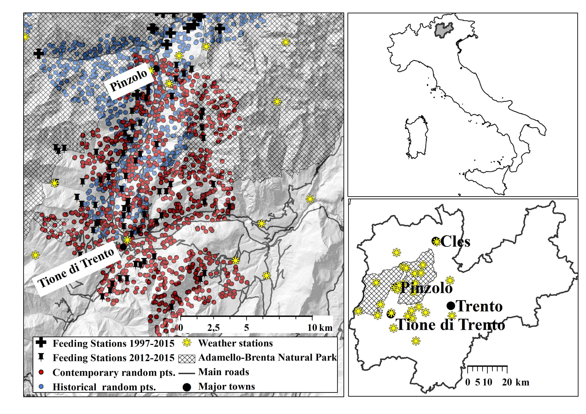

```{r setup, include=FALSE}
knitr::opts_chunk$set(echo = FALSE)
library(magrittr)
```

# Foreword 

Winter snowy conditions and the wildlife management strategies play a
critical role in governing the spatial distribution of ungulates in temperate ecosystems.
Snow depth severely restricts roe deer distribution due to the limitations resulting from
their small body mass (18-49 kg: @Lister1998) and short legs (50-60 cm: @Holand1998).  Large roe deers living in snowy areas, employ a partial migration strategy, with all
individuals overwintering in ranges characterized by less extreme snow conditions. Consequently, snow occurrence constitutes a proxy for animal location and movements. Due to the recently observed strong variability of climate and snow conditions in alpine areas,  **a high-resolution topography-accounting spatio-temporal modelling of snow cover is required. **
{width=100%}

# Hydrological modelling 

GEOtop 2.0 Hydrological Model (@Endrizzi2014, [www.geotop.org](http://www.geotop.org)) is  a physically-based *spatially distributed* model solving water and energy balance differential equation, **producing snow depth area maps from meteorological data by taking into account snow melting process**. 

{width=100%}

Input weather forcings (25-year long):

* Observed time series in the weather stations ([wwww.meteotrentino.it](https://www.meteotrentino.it)) (1 scenario); 

* Downscaled data by regional climate model projections (@Rockel2008, *courtesy of Emanuel Eccel and CMCC*) (IPCC scenarios RCP4.5 and RCP 8.5) (2 scenarios). 

Snow mean depth and snow cover are aggregated from daily to seasonal scale (NDJFMA)(@geotopbricks). RCP4.5 ns RCP8.5 illustrated scenarios are created with weather forcings having patterns similar to both 2013-2014 and 2014-2015 observed seasons, but modified accordingly to the projections.  


```{r maps, echo=FALSE, out.width='90%', fig.align = "center", results='asis'}
library(stringi)
library(stringr)
some_text <- stri_rand_lipsum(1)
some_text <- "ciao" ##paste("**Image description**", "[@R-bookdown]", "<br/>", some_text)
figpath <- "resources/images/map/"
##years <- c(1990,1991,1992,1993,1995,1997,2002,2005,2006,2007,2014,2015)
years   <- c(1990,1991,1997,2002,2006,2007,2014,2015)[-1]
suffix  <- paste("OBS",years,sep="_")
years_rcp45   <- c(2014,2015)
suffix_rcp45  <- paste("RCP45",years_rcp45,sep="_")
years_rcp85   <- years_rcp45
suffix_rcp85  <- paste("RCP85",years_rcp85,sep="_")

#years_fut <- c("RCP45","RCP85")
#suffix_fut  <- paste("RCP45",years_fut,2014,sep="_")
#years_fut2 <- years_fut
#suffix_fut2  <- paste(years_fut2,2015,sep="_")

years <- c(paste(years-1,years,sep="-"),c(suffix_rcp45,suffix_rcp85) %>% str_replace_all("_","-") %>% unlist())
suffix <- c(suffix,suffix_rcp45,suffix_rcp85)

snow_depth_mean_png <- "mean_%s_winter.png" %>% sprintf(suffix)
snow_depth_nday_png <- "nday_%s_winter.png" %>% sprintf(suffix)


dat <- data.frame(
  year=years,
  "Snow Depth [mm]" = 
    paste0("{#id .class height=295px}"),
  "Snow cover duration" =
     paste0("{#id .class height=295px}")
##   paste0("{#id .class height=350px}"),
###   paste0("{#id .class height=350px}")[1]
   

  )

library(knitr)
kable(dat, col.names=c("Winter","Mean Depth [mm]","Duration [days]"),format = 'pandoc')
```


Higher variability on snow cover, .i.e *snow depth > 5 cm*, and depth occurs at medium and low elevations  in the decade 2006-2015 (latest year of the analysis) than in the past decade 1996-2005. Future climate projections confirm this behaviour.


```{r snow-altitude, out.width='100%', fig.align='center', fig.cap=NULL, fig.height=5,warning=FALSE}
##plot(mtcars[1:2]) ## PUT FIGURE HERE ##
library(ggplot2)
title <- c("Duration (days)","Mean Depth (mm)","Max Depth (mm)")
oo2_1 <- read.table("resources/data/mean_altitude.csv",sep=",",header=TRUE)
oo2_1$variable <- title[2]
oo2_2 <- read.table("resources/data/max_altitude.csv",sep=",",header=TRUE)
oo2_2$variable <- title[3]
oo2_3 <- read.table("resources/data/nday_altitude.csv",sep=",",header=TRUE)
oo2_3$variable <- title[1]

oo2 <- rbind(oo2_1,oo2_2,oo2_3)

ggq <- ggplot(data = oo2, aes(x=altitude,y=median, by=decade, color=decade,fill=decade))+geom_line()
ggq <- ggq+ylab("Snow Cover/ Snow Quantity")+xlab("Elevation (m a.s.l.)")
## NO TITLE ggggq <- ggq+ggtitle(title)
ggq <- ggq+geom_ribbon(data = oo2, aes(x=altitude,ymax=q75,ymin=q25, color=decade,by=decade,alpha=decade))+scale_alpha_manual(name="Q25-Q75",values=c(0.3,0.3,0.3,0.3),breaks=NULL)

ggq <- ggq+scale_color_manual(name="Decade/Scenario",values=c("blue","green","magenta","orange"),breaks=NULL)
ggq <- ggq+scale_fill_manual(name="Decade/Scenario",values=c("blue","green","magenta","orange"))

ggq <- ggq+theme_bw()
ggq <- ggq+facet_grid(variable ~ scenario_type,scales="free_y")+ggtitle("Snow Cover/Snow Quantity vs Elevation")

show(ggq)


```
 
# Ecological modelling 
 
Roe deer in presence of snow strongly try to select zones with canopy cover and avoided places with high snow depths. Snow modelling results have been coupled with ecological campaign periods (1999-2002: (a); 2012-2015: (b))(see prediction plots of relative probability of use of forested habitats during ,*Bright Ross at al, Article in preparation*)

{width=90%}


# Concluding remarks 


1.Climate and snow variability is a challenge for researching on habitat selection by roe deer (Capreolus capreolus) in an alpine area;

2.Physically-based modelling allows to estimate snow depth in a gridded spatio-temporal coverage accounting for topographical details from terrestrial weather observations; 

3. In the study area snow cover and depth variability increases with climate change projections.


# References

```{r, include=FALSE}
 knitr::write_bib(c('knitr','rmarkdown','posterdown','pagedown'), 'packages.bib')
```


<!-- ```{r generateBibliography,echo=FALSE,eval=TRUE,message=FALSE,warning=FALSE,print=FALSE,results="hide",output=TRUE} -->
<!-- require("knitcitations") -->
<!-- cleanbib() -->
<!-- options("citation_format" = "pandoc") -->
<!-- read.bibtex(file = "bibliography.bib") -->
<!-- knitr::write_bib(file = "bibliography.bib") -->

<!-- ``` -->
