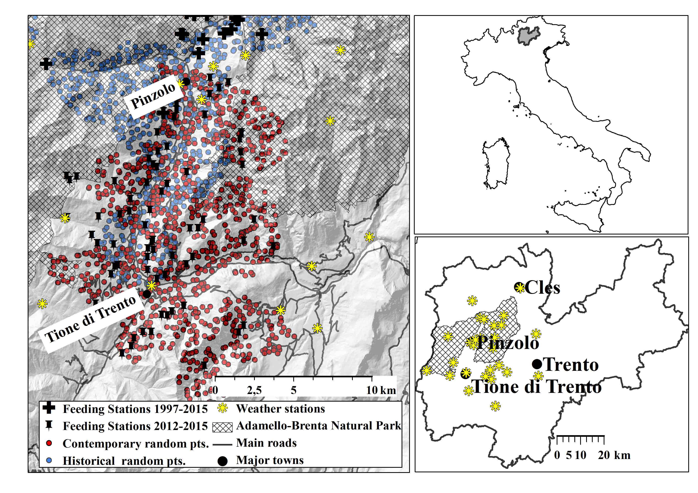
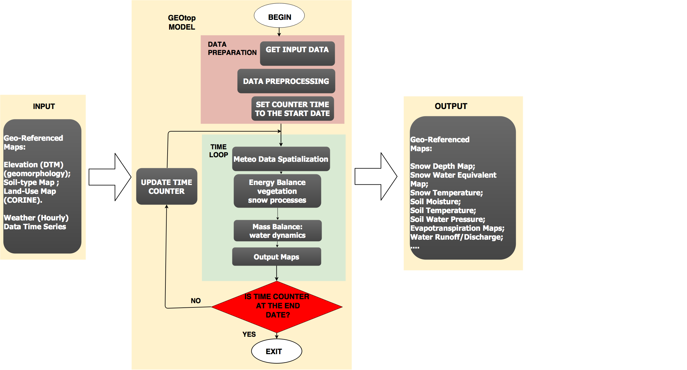

```{r setup, include=FALSE}
knitr::opts_chunk$set(eval = TRUE)
knitr::opts_chunk$set(fig.cap = FALSE)
knitr::opts_knit$set(fig.cap = FALSE)
knitr::opts_template$set(fig.cap = FALSE)
knitr::opts_knit$set(unnamed.chunk.label = "fig")
```

## Foreword  

Occurrence of large herbivore depending on  feeding station location and **snow cover**:   

{width=70%}\


## Hydrological Modelling

GEOtop hydrological model (www.geotop.org):

{width=90%}\


## Hydrological Modelling  


```{r maps, echo=FALSE, out.width='90%', fig.align = "center", results='asis'}
library(stringi)
library(stringr)
some_text <- stri_rand_lipsum(1)
some_text <- "ciao" ##paste("**Image description**", "[@R-bookdown]", "<br/>", some_text)
figpath <- "resources/images/map/"
##years <- c(1990,1991,1992,1993,1995,1997,2002,2005,2006,2007,2014,2015)
years   <- c(2014,2015) ##c(1990,1991,1997,2002,2006,2007,2014,2015)[-1]
suffix  <- paste("OBS",years,sep="_")
years_rcp45   <- c(2014,2015)
suffix_rcp45  <- paste("RCP45",years_rcp45,sep="_")
years_rcp85   <- years_rcp45
suffix_rcp85  <- paste("RCP85",years_rcp85,sep="_")


##years <- c(paste(years-1,years,sep="-"),c(suffix_rcp45,suffix_rcp85) %>% str_replace_all("_","-") %>% unlist())
##suffix <- c(suffix,suffix_rcp45,suffix_rcp85)

snow_depth_mean_png <- "mean_%s_winter.png" %>% sprintf(suffix)
snow_depth_nday_png <- "nday_%s_winter.png" %>% sprintf(suffix)
years <- c(paste(years-1,years,sep="-"))

dat <- data.frame(
  year=years,
  "Snow Depth [mm]" = 
    paste0("{#id .class height=100px}"),
  "Snow cover duration" =
     paste0("{#id .class height=100px}")
##   paste0("{#id .class height=350px}"),
###   paste0("{#id .class height=350px}")[1]
   

  )

library(knitr)
kable(dat, col.names=c("Winter","Mean Depth [mm]","Duration [days]"),format = 'pandoc')
```


## Analytics 


```{r snow-altitude, echo=FALSE,out.width='90%', fig.align='center', fig.cap=NULL, fig.height=5,results='asis',warning=FALSE}


library(ggplot2)
title <- c("Duration (days)","Mean Depth (mm)","Max Depth (mm)")
oo2_1 <- read.table("resources/data/mean_altitude.csv",sep=",",header=TRUE)
oo2_1$variable <- title[2]
oo2_2 <- read.table("resources/data/max_altitude.csv",sep=",",header=TRUE)
oo2_2$variable <- title[3]
oo2_3 <- read.table("resources/data/nday_altitude.csv",sep=",",header=TRUE)
oo2_3$variable <- title[1]

oo2 <- rbind(oo2_1,oo2_2,oo2_3)

ggq <- ggplot(data = oo2, aes(x=altitude,y=median, by=decade, color=decade,fill=decade))+geom_line()
ggq <- ggq+ylab("Snow Cover/ Snow Quantity")+xlab("Elevation (m a.s.l.)")
## NO TITLE ggggq <- ggq+ggtitle(title)
ggq <- ggq+geom_ribbon(data = oo2, aes(x=altitude,ymax=q75,ymin=q25, color=decade,by=decade,alpha=decade))+scale_alpha_manual(name="Q25-Q75",values=c(0.3,0.3,0.3,0.3),breaks=NULL)
values_color=
##
#Historical data (1999-2002): "#0571b0"
#Contemporary data (2012-2015): "#C93B51"
#4.5 forecast: "#593B6A"    
#8.5 forecast: "#B7011D"  
  
##  
values_color=c("blue","green","magenta","orange")
values_color=c("#0571b0","#C93B51","#593B6A","#B7011D")
##
ggq <- ggq+scale_color_manual(name="Decade/Scenario",values=values_color,breaks=NULL)
ggq <- ggq+scale_fill_manual(name="Decade/Scenario",values=values_color)

ggq <- ggq+theme_bw()
ggq <- ggq+facet_grid(variable ~ scenario_type,scales="free_y")+ggtitle("Snow Cover/Snow Quantity vs Elevation")

show(ggq)
```
 
 
## Analytics (only nday - with no title)


```{r snow-altitude-2, echo=FALSE,out.width='90%', fig.align='center', fig.cap=NULL, fig.height=5,results='asis',warning=FALSE}


library(ggplot2)
title <- c("Duration (days)","Mean Depth (mm)","Max Depth (mm)")
oo2_1 <- read.table("resources/data/mean_altitude.csv",sep=",",header=TRUE)
oo2_1$variable <- title[2]
oo2_2 <- read.table("resources/data/max_altitude.csv",sep=",",header=TRUE)
oo2_2$variable <- title[3]
oo2_3 <- read.table("resources/data/nday_altitude.csv",sep=",",header=TRUE)
oo2_3$variable <- title[1]

oo2 <- oo2_3 ####rbind(oo2_1,oo2_2,oo2_3)

ggq3 <- ggplot(data = oo2, aes(x=altitude,y=median, by=decade, color=decade,fill=decade))+geom_line()
ggq3 <- ggq3+ylab("Snow Cover/ Snow Quantity")+xlab("Elevation (m a.s.l.)")
## NO TITLE ggggq <- ggq+ggtitle(title)
ggq3 <- ggq3+geom_ribbon(data = oo2, aes(x=altitude,ymax=q75,ymin=q25, color=decade,by=decade,alpha=decade))+scale_alpha_manual(name="Q25-Q75",values=c(0.3,0.3,0.3,0.3),breaks=NULL)
#values_color=
##
#Historical data (1999-2002): "#0571b0"
#Contemporary data (2012-2015): "#C93B51"
#4.5 forecast: "#593B6A"    
#8.5 forecast: "#B7011D"  
  
##  
values_color=c("blue","green","magenta","orange")
values_color=c("#0571b0","#C93B51","#593B6A","#B7011D")
##
ggq3 <- ggq3+scale_color_manual(name="Decade/Scenario",values=values_color,breaks=NULL)
ggq3 <- ggq3+scale_fill_manual(name="Decade/Scenario",values=values_color)

ggq3 <- ggq3+theme_bw()
ggq3 <- ggq3+facet_grid(variable ~ scenario_type,scales="free_y") ##+ggtitle("Snow Cover/Snow Quantity vs Elevation")

show(ggq3)
```
 
 
 
 
