```{r setup, include=FALSE}
knitr::opts_chunk$set(eval = TRUE)
knitr::opts_chunk$set(fig.cap = FALSE)
knitr::opts_knit$set(fig.cap = FALSE)
knitr::opts_template$set(fig.cap = FALSE)
knitr::opts_knit$set(unnamed.chunk.label = "fig")
library(geotopbricks)
```

## Who are we?

\begincols

\begincol{0.28\textwidth} 


{width=100%}\ 

{width=70%}\
{width=70%}\
\endcol

\begincol{0.7\textwidth}

- Environmental engineers with hydrological background (more deterministic and physicall-based than statics!)
- Some of us are reserchers, other are self-employed and freelancers - www.rendena100.eu .  
- Some of us are authors of several R-packages and R enthusiast. 
- Some of us are developers of GEOtop hydrologic models with skills in hydrology and environmental science and also in C/C++, parallell programming, High Perfomance Computing, etc

\endcol

\endcols

## Hydrology

Scientific study of the movement, distribution, and quality of water on Earth and other planets, including the water cycle, water resources and environmental watershed sustainability.[_Wikipedia_]
\begincols
\begincol{.48\textwidth}
{width=100%}\
\endcol
\begincol{.48\textwidth}
 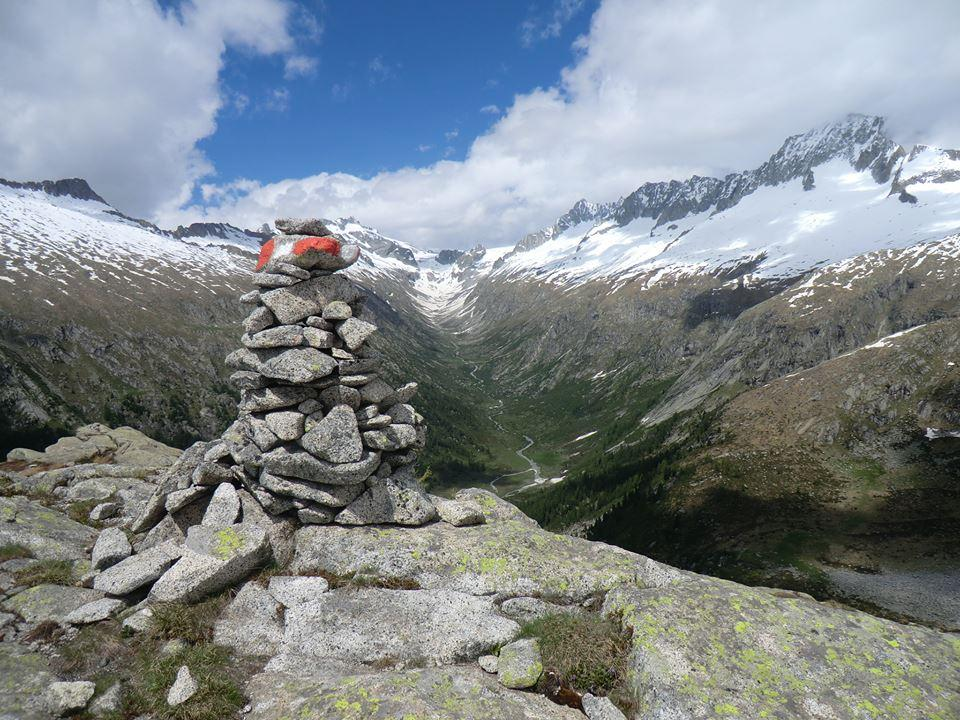{width=100%}\
\endcol
\endcols

## Hydrolgical models


\begincols
  \begincol{.58\textwidth}

  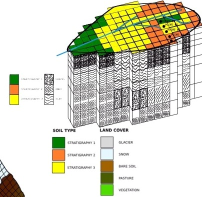{width=70%}\ 
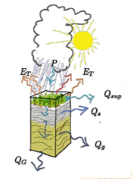{width=50%}\
  \endcol
\begincol{.02\textwidth}
\endcol
\begincol{.36\textwidth}

Models that calculates water river discharge, soil water content,evapotranspiration, etc.  (*output*) in function of weather time series and soil/land/geomorphological characterization (*input*).

\endcol
\endcols
Soil water mass balance equation:
$$\frac{\partial \theta}{\partial t} =   \nabla  \cdot \left[ K \left(\nabla (\psi+z_f) \right) \right] + S + ...$$
Soil Heat (energy) balance equation:
$$C_s \frac{\partial T_s}{\partial t} =  \nabla  \cdot \left[ K_t  ( \nabla T_s  ) \right] + \lambda S + ...$$


## GEOtop Hydrological Model 

GEOtop hyodrological model solves water mass balance and energy balance equations coupled with the exchanges between terrain and lower atmoshere with the following two setup configurations:

- __1D__: only vertical fluxes $\,\to\,$ mass and energy balance at local scale (only in one soil column)

- __3D__: vertical and lateral fluxes $\,\to\,$ balances at basin scale

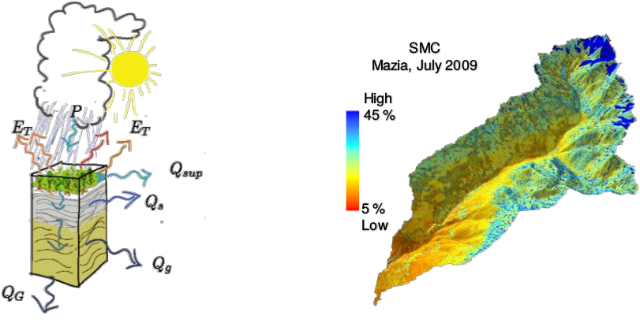{width=60%}\


## GEOtop Hydrological Model Software Package / Source Code


Core components of GEOtop software packages are: 

- written in C/C++
- released in 2014 (version 2.0) as free open-source project, a re-engineering process is going to finish (version 3.0); 
- scientifically tested and published;

Source code and documentation are available on GitHub repository: [http://geotopmodel.github.io/geotop/].

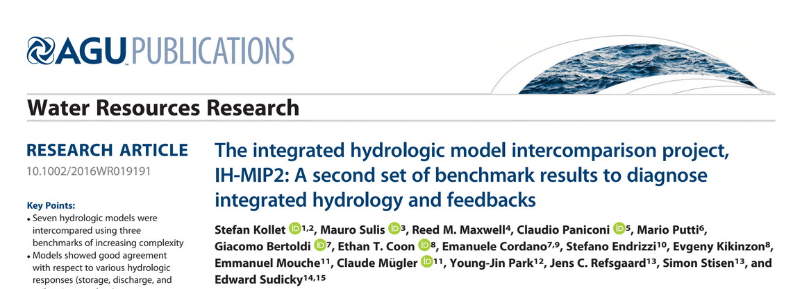{width=90%}\


## geotopbricks R package: Why? 

- complexity in input/output/configuration files (_"frontend"_) and data difficult to handle
- need of user friendly environment for to GEOtop data tidying and data analytics (e.g. _R_)
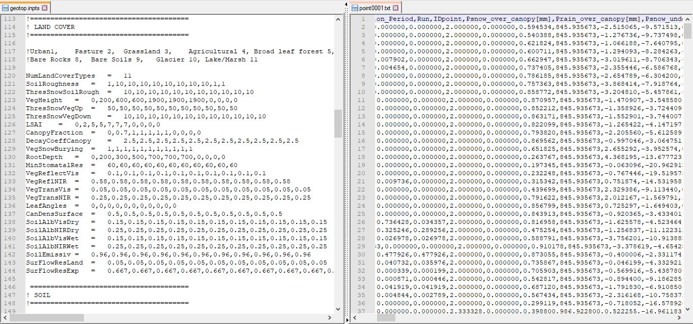{width=90%}\


<!-- - potential interactions between hydrology (__GEOtop__) and other knowledge domains (_discipines_). -->


## GEOtop simulation configuration file (geotop.inpts)

A GEOtop simulation is organized in a set of files within a directory containing a **configuration file** ,called _geotop.inpts_ filled with a keywords system addressing to simulation options (e.g. simulation period), **input files** (e.g. meteorological time series, soil and geomorphology of the basin), **output files** (spatio-temporal maps of the results).

<!-- \begincols -->
<!--   \begincol{.30\textwidth} -->

<!-- - simulation options (e.g. simulation period) -->
<!-- - **input files** (e.g. meterological time series) -->
<!-- - **output files**  -->

<!--   \endcol -->
<!--    \begincol{.65\textwidth} -->
```
InitDateDDMMYYYYhhmm=09/04/2014 18:00  
EndDateDDMMYYYYhhmm =01/01/2016 00:00 
[...] 
MeteoFile           ="meteoB2_irr" 
PointOutputFile     ="tabs/point" 
```
<!-- \endcol -->
<!-- \endcols -->


## geotopbricks R package: what it does 

The aim of **geotopbricks** , starting in 2013, is to bring all the data of a GEOtop simulaton into the powerful statistical
**R** environment by using the `keyword-value` syntax of *geotop.inpts*. **geotopbricks** does the following actions:

- to parse _geotop.inpts_ configuration files;
- to derive from _geotop.inpts_'s keywords the source files of I/O data;
- to import time series (e.g. precipitation, temperature, soil water content, snow) as _zoo_ or _data.frame_ objects;
- to import spatially and spatio-temporal gridded objects as _RasterLayer-class_ or _RasterBrick-class_ objects (**raster** package) 

## 1D Simulation of soil water budget in an alpine site:  two points
Soil water content (SWC) in two points **P2** and **B2** located in Val Mazia/Match, Malles Venosta/Mals Vinschgau, South Tyrol, Italy [http://lter.eurac.edu/en].
\begincols

\begincol{0.30\textwidth}
 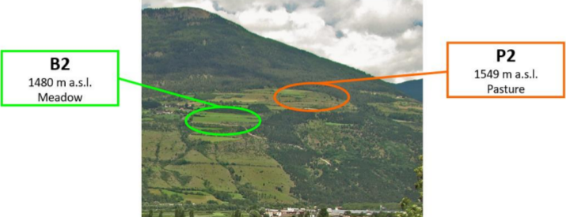{width=100%}\
 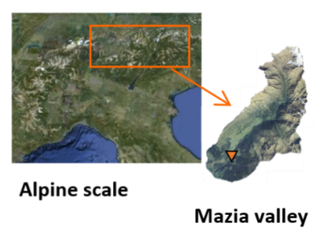{width=100%}\
\endcol
\begincol{0.30\textwidth}
{width=100%}\
\endcol
\begincol{0.40\textwidth}
 
 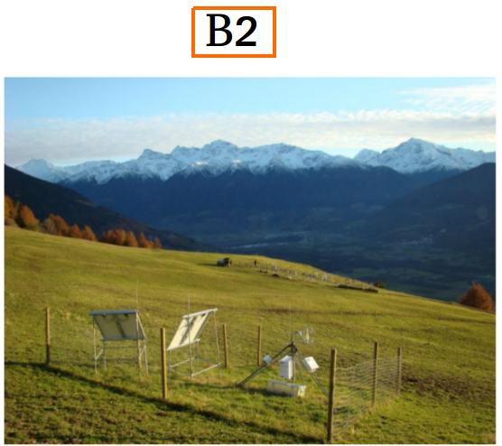{width=100%}\
 \endcol
 \endcols
 
 
 
 
<!--CHANGE THE FIGUE !!! -->


## Simulation of soil water budget in an alpine site

Here is the directory containing files of B2 point simulation: 
```{r,echo=TRUE,return=FALSE}
library(geotopbricks) 

## SET GEOTOP SIMULATION DIRECTORY
wpath_B2 <- "resources/simulation/Matsch_B2_Ref_007" 

```
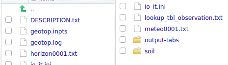{width=100%}\


## Getting simulation input data

Meteorological variable time series are imported and saved as *meteo* variable (class *zoo*). This variable is retrieved through the GEOtop keyword  __MeteoFile__ : 

```{r,echo=TRUE,return=TRUE}
tz <- "Etc/GMT-1"
meteo <- get.geotop.inpts.keyword.value(
  "MeteoFile",
  wpath=wpath_B2,
  data.frame=TRUE,
  tz=tz)
class(meteo)
```

## Getting simulation input data (verify)

Meteorological time series once imported are available in the R environment:
```{r,echo=TRUE,return=TRUE}
head(meteo[12:14,c("Iprec","AirT","Swglobal")])
```
```{r,echo=TRUE,eval=FALSE}
head(meteo[12:14,c("RelHum","WindSp","WindDir")])
```


## Plots of weather variables at B2 

```{r,echo=FALSE,return=TRUE,warning=FALSE,results="hide",message=FALSE,fig.height=5,fig.cap=""}
library(ggplot2)
library(reshape2)
library(lubridate)
meteo_df <- as.data.frame(meteo)
nvars <- c("Iprec","WindSp","WindDir","RelHum","AirT","Swglobal")
meteo_df$time <- as.POSIXct(index(meteo))
cols <- c("time","Iprec","WindSp","WindDir","RelHum","AirT","Swglobal")
offset <- array(0,length(cols))
names(offset) <- cols
multp <- array(1,length(cols))
names(multp) <- cols

offset["AirT"] <- 0
multp["Swglobal"] <- 50
multp["Iprec"] <- 0.1
when <- as.Date("2010-05-10")+days(0:10)
iwhen <- as.Date(meteo_df$time) %in% when
###
cols_ <- c("AirT","Iprec")
variables <- c("Air Temperature","Precipitation Intensity")
names(variables) <- cols_
fills <- c("red", "blue")
names(fills) <- cols_
alphas <- c(0.1,0.5)
names(alphas) <- cols_
####


meteo_df <- meteo_df[iwhen,c("time",cols_)]
meteo_df0 <- meteo_df
itref <- "Iprec"
itnoref <- cols_[cols_!=itref][1]

for (it in cols_) {
  meteo_df[,it] <- (meteo_df[,it]-offset[it]) / multp[it]
  meteo_df[,it] <- meteo_df[,it]*multp[itref]+offset[itref]
}

a <- multp[itnoref]/multp[itref]
b <- offset[itnoref]-a*offset[itref]

meteo_dfm <- melt(meteo_df,id="time")
gp <- ggplot(meteo_dfm, aes(x = time, y = value)) + 
   geom_area(aes(color = variable, fill = variable, alpha=variable), 
             position = position_dodge(0.8)) +
   scale_color_manual(values = fills[cols_],labels=variables[cols_]) +
   scale_fill_manual(values = fills[cols_],labels=variables[cols_])+
   scale_alpha_manual(values= alphas[cols_],labels=variables[cols_])+theme_bw()+
  scale_y_continuous(
    "Precipitation Intensity [mm/hr]", 
    sec.axis = sec_axis(~ . * a+b, name = "Air Temperature [C deg]")
  )+ggtitle("Air Temperature / Precipiation Intensity vs Time at B2")+
  theme(text = element_text(size=15))+xlab("Time")
gp
```

## Getting results of the  simulation at B2

Soil Water Content Profile: 
```{r,echo=TRUE,return=FALSE}
tz <- "Etc/GMT-1"
SWC_B2  <- get.geotop.inpts.keyword.value(
  "SoilLiqContentProfileFile",
  wpath = wpath_B2,
  data.frame = TRUE,
  date_field = "Date12.DDMMYYYYhhmm.",
  tz = tz,
  zlayer.formatter = "z%04d"
)
help(get.geotop.inpts.keyword.value) ## for more details!
```

## Getting results of the  simulation at P2

The same for P2:
```{r,echo=TRUE,return=FALSE}
wpath_P2 <- "resources/simulation/Matsch_P2_Ref_007" 
SWC_P2  <- get.geotop.inpts.keyword.value(
  "SoilLiqContentProfileFile",
  wpath = wpath_P2,
  data.frame = TRUE,
  date_field = "Date12.DDMMYYYYhhmm.",
  tz = "Etc/GMT-1",
  zlayer.formatter = "z%04d")
  

```


```{r,echo=FALSE,eval=TRUE,return=FALSE,warning=FALSE,results='hide'}
class(SWC_B2)
```

```{r,echo=FALSE,eval=TRUE,return=FALSE,warning=FALSE,results='hide'}
SWC_B2 <- cbind(time=as.POSIXct(index(SWC_B2)),as.data.frame(SWC_B2))
SWC_P2 <- cbind(time=as.POSIXct(index(SWC_P2)),as.data.frame(SWC_P2))
class(SWC_B2)
names(SWC_B2)
###knitr::kable(head(SWC_B2))
```

## Soil Water Content at P2 and B2 

```{r,echo=FALSE,return=TRUE,warning=FALSE,results="hide",message=FALSE,fig.height=5,fig.cap=""}
## http://www.sthda.com/english/wiki/ggplot2-line-types-how-to-change-line-types-of-a-graph-in-r-software
SWC_B2a <- SWC_B2[as.Date(SWC_B2$time) %in% when,]
SWC_P2a <- SWC_P2[as.Date(SWC_P2$time) %in% when,]
zdepths <- c(3,9,18,45)
depths <- names(zdepths) <- sprintf("z%04d",zdepths)
hudepths <- sprintf("depth %02d cm",zdepths)
fills <- c("#d7191c","#fdae61","#a6d96a","#1a964")
names(fills) <- hudepths
###
when_b2 <- when


###
names(hudepths) <- depths
SWC_B2a$site <- "B2"
SWC_P2a$site <- "P2"
SWC_B2m <- melt(SWC_B2a,id=c("time","site"))
SWC_P2m <- melt(SWC_P2a,id=c("time","site"))

SWC <- rbind(SWC_B2m,SWC_P2m)
SWC <- SWC[SWC$variable %in% depths,]
##stop("HERE")
##SWC$variable <- hudepths[as.character(SWC$variable)]
gswc <- ggplot(SWC, aes(x = time, y = value)) + 
   geom_line(aes(color = variable, fill = variable, linetype=site), 
             position = position_dodge(0.8))+theme_bw() +  theme(text = element_text(size=15))+xlab("Time")+ylab("Soil Water Content") 
 gswc <- gswc+scale_color_manual(values=rainbow(length(depths)),labels=hudepths[depths])

show(gswc)

```


## 3D Spatially Distributed Distribution: Val Venosta/Vinschgau - Upper Adige River Basin - Alps - I/CH/A

```{r,echo=TRUE,eval=TRUE,return=FALSE,warning=FALSE}
wpath_3D <- 'resources/simulation/Vinschgau'
basin <- get.geotop.inpts.keyword.value("LandCoverMapFile",
              wpath=wpath_3D,raster=TRUE)
basin
```

##  Input GeoSpatial Map: Elevation and Weather Station

```{r,echo=FALSE,return=TRUE,warning=FALSE,results="hide",message=FALSE,fig.height=5,fig.cap=""}
URL = 'https://{s}.tile.opentopomap.org/{z}/{x}/{y}.png'
ATTRIBUTION = 'Map data: &copy; <a href="http://www.openstreetmap.org/copyright">OpenStreetMap</a>, <a href="http://viewfinderpanoramas.org">SRTM</a> | Map style: &copy; <a href="https://opentopomap.org">OpenTopoMap</a> (<a href="https://creativecommons.org/licenses/by-sa/3.0/">CC-BY-SA</a>)'
library(leaflet)

elevation <- get.geotop.inpts.keyword.value("DemFile",wpath=wpath_3D,raster=TRUE)
basin <- basin*0+elevation
color <- colorNumeric("BrBG",domain=basin[],na.color="transparent",reverse = TRUE) ## http://colorbrewer2.org
opacity <- 0.8

meteoloc <- data.frame(x=get.geotop.inpts.keyword.value("MeteoStationCoordinateX",wpath=wpath_3D,numeric=TRUE))
meteoloc$y <- get.geotop.inpts.keyword.value("MeteoStationCoordinateY",wpath=wpath_3D,numeric=TRUE)
coordinates(meteoloc) <- ~ x+y 
projection(meteoloc) <- projection(basin)
meteoloc <- spTransform(meteoloc,CRSobj="+proj=longlat +ellps=WGS84 +datum=WGS84 +no_defs")
meteoloc <- as.data.frame(meteoloc)
#leaf_psi <- leaf1 %>% addRasterImage(theta,color=color,opacity=opacity) %>% 
#addLegend(position="bottomright",pal=color,values=theta[],opacity=opacity,title="Psi") %>% #addMarkers(lng=points$lon,lat=points$lat,label=points$name)

#leaf_psi
leaf <- leaflet() %>% addTiles(urlTemplate=URL,attribution=ATTRIBUTION) 
leaf %>% addRasterImage(basin,opacity=opacity,col=color) %>% addLegend(position="bottomright",pal=color,values=basin[],opacity=opacity,title="Elevation [m]") %>% 
addCircleMarkers(lng=meteoloc$x,lat=meteoloc$y,label="Meteo",opacity=opacity,radius=2,color="red") %>% 
  addScaleBar()


```


## 3D Spatially Distributed Simulation (Output Geospatial Map): Soil Water Content

```{r,echo=FALSE,return=TRUE,warning=FALSE,results="hide",message=FALSE,fig.height=5,fig.cap=""}
library(RColorBrewer)
keyword <- 'SoilLiqContentTensorFile'
s <- get.geotop.inpts.keyword.value(keyword,wpath=wpath_3D)
start <-  get.geotop.inpts.keyword.value("InitDateDDMMYYYYhhmm",date=TRUE,wpath=wpath_3D,tz=tz) 
end <- get.geotop.inpts.keyword.value("EndDateDDMMYYYYhhmm",date=TRUE,wpath=wpath_3D,tz=tz) 
whenx <- end-years(1)-months(2)
b <- brickFromOutputSoil3DTensor(x=keyword,when=whenx,wpath=wpath_3D,tz=tz)
##plot(b,col=heat.colors(10))
color_b <- colorRampPalette((brewer.pal(20,"PuBu")))
rasterVis::levelplot(b,margin=FALSE,col.regions=color_b,xlab=NULL,ylab=NULL,scales=list(draw=FALSE))
```

```
brickFromOutputSoil3DTensor("SoilLiqContentTensorFile", 
wpath=wpath_3D,when="2011-08-16 12:00:00 +01")
```


## 3D Spatially Distributed Simulation (Output Geospatial Map): Surface Water Discharge at the Outlet 

```{r,echo=FALSE,return=TRUE,warning=FALSE,results="hide",message=FALSE,fig.height=5,fig.cap=""}

dis <- get.geotop.inpts.keyword.value("DischargeFile",wpath=wpath_3D,data.frame=TRUE,formatter="",date_field="DATE.day.month.year.hour.min.",tz=tz)
bas <- get.geotop.inpts.keyword.value("BasinOutputFile",wpath=wpath_3D,data.frame=TRUE,formatter="",date_field="Date12.DDMMYYYYhhmm.",tz=tz)
##dygraphs::dygraph(dis$Qtot.m3.s.)

dis_df <- as.data.frame(dis)
dis_df$time <- as.POSIXct(index(dis))
bas_df <- as.data.frame(bas)
bas_df$time <- as.POSIXct(index(bas))
ndis <- c("time","Qtot.m3.s.")
nbas <- c("time","Pnet.mm.","Evap_surface.mm.","Transpiration_canopy.mm.")
dis_df  <- dis_df[,ndis]
bas_df  <- bas_df[,nbas]
cond <- all(dis_df$time==bas_df$time)
if (!cond) stop("Mismacth dates between bas_df and dis_df")
bas_df <- bas_df[,nbas[nbas!="time"]]
basin_results_df0 <- cbind(dis_df,bas_df)
dt0 <- as.numeric(diff(basin_results_df0$time)[1],unit="secs")
#### NON-dplyr DAILY AGGRAGATION
basin_results_df1 <- NULL
cols_ <- names(basin_results_df0)
cols_ <- cols_[cols_!="time"]
dates <- as.Date(basin_results_df0$time)
for (it in cols_) {
   
  val <- tapply(X=basin_results_df0[,it],INDEX=dates,FUN=mean,na.rm=TRUE)
  if (it==cols_[1]) {
    basin_results_df1 <- data.frame(time=as.Date(names(val)),stringsAsFactors = FALSE )
  }
  if (it!="Qtot.m3.s.")  val <- val/dt0*24*3600
  basin_results_df1[,it] <- val 
  
  
}


```


```{r,echo=FALSE,return=TRUE,warning=FALSE,results="hide",message=FALSE,fig.height=5,fig.cap=""}
library(ggplot2)
library(reshape2)
library(lubridate)
basin_results_df <- basin_results_df1
basin_results_df["Pnet.mm."] <- -basin_results_df["Pnet.mm."]
cols <- names(basin_results_df)
offset <- array(0,length(cols))
names(offset) <- cols
multp <- array(1,length(cols))
names(multp) <- cols


### area basin
area <- length(which(!is.na(basin)[]))*xres(basin)*yres(basin)
dt <- as.numeric(diff(basin_results_df$time)[1],unit="secs")

#offset["AirT] <- 0
vmult <- 20
carea <- (area/(dt*1000)/vmult)^(-1)
multp["Pnet.mm."] <- carea
multp["Evap_surface.mm."] <- carea
multp["Transpiration_canopy.mm."] <- carea

itref <- "Qtot.m3.s."
itnoref <- "Pnet.mm."
multp[itref] <- 2
a <- multp[itnoref]/multp[itref]
offset[itnoref] <- -ceiling(max(abs(basin_results_df[,itref])))*a
offset[itnoref] <- -100 ## manual correction for a human readable scale
b <- offset[itnoref]-a*offset[itref]
 


when <- as.Date("2010-11-01")+days(0:365)
iwhen <- as.Date(basin_results_df$time) %in% when

cols_ <- cols[cols!="time"] ###("AirT","Iprec")

basin_results_df <- basin_results_df[iwhen,c("time",cols_)]
##itref <- "Pnet.mm."
###cols_[cols_!=itref][1]

##cols_ <- c(itref,itnoref)
for (it in cols_) {
  basin_results_df[,it] <- (basin_results_df[,it]-offset[it]) / multp[it]
  basin_results_df[,it] <- basin_results_df[,it]*multp[itref]+offset[itref]
}


breaks <- seq(from=0,to=offset[itnoref],length.out=6)
breaks <- as.integer(breaks)
labels <- sprintf("%d / %d",-breaks,-offset[itnoref]+breaks)
fill_ <- c("red", "blue","brown","green")
names(fill_) <- cols_
##
labels_ <- c("Discharge","Precipitation","Evaporation","Transpiration")
names(labels_) <- cols_

###


###

basin_results_dfm <- melt(basin_results_df,id="time")
basin_results_dfm <- basin_results_dfm[as.character(basin_results_dfm$variable) %in% cols_,]
gp <- ggplot(basin_results_dfm, aes(x = time, y = value)) 
gp <- gp+ geom_line(aes(color = variable), 
             position = position_dodge(0.8)) +
   scale_color_manual(values = fill_[cols_],labels=labels_[cols_]) +
  theme_bw()+
  scale_y_continuous(
    "Discharge [m^3/s]", 
    sec.axis = sec_axis(~ . * (a)+b, name = "Precipitation  - Evapotranspiration [mm/day]",breaks=breaks,labels=labels)
  )+theme(text = element_text(size=15))+xlab("Time")
gp

###BUGS: 
##https://stackoverflow.com/questions/55105952/sec-axis-in-ggplot2-doesnt-show-up-where-expected

```


## Discussion


- **geotopbricks** allows graphical Representation using R of GEOtop results , useful for hydrologigists and Reaserchers;

- Though **geotopbricks** user can interact between R and GEOtop using R enviroment and GEOtop keywords system, without using the GEOtop simulation structure.   

- Processing of a GEOtop simulation is always reproducible for any other simulation; results can be automatically documented in reports or presentations. 


## Conclusions and Way Forward

- **geotopbricks** is an interface of GEOtop in R speaking the language of GEOtop;

- Open Source (and not only) Hydrolgical Model needs powerful interfaces to process I/O in a FAIR way;

- R code based on **geotopbricks** can help the implantetion of further package or apps: analityics, model calibration, visualization.


## Finally 

Aknowledgements to 

- all __GEOtop__ developers and users' group, in particular _Matteo Dall'Amico, Stefano Cozzini, Alberto Sartori, Stefano Endrizzi, Samuel Senoner, Riccardo Rigon_, who provided images about GEOtop and hydrologic models for this presentation
- the community of __R__ whose packages allow to analize and visualise GEOtop data. 


 If intertested?   See and follow us on (www.geotop.org) or (https://cran.r-project.org/package=geotopbricks)  


Thank you for your attention! / Merci pour votre attention!  
Find us as  **@ecor**  (presenter) or **@EURAC-Ecohydro** (co-authors)  on *GitHub*. 


## Addendum 

## GEOtop Hydrological Model Flowchart

\begincols

\begincol{.69\textwidth}
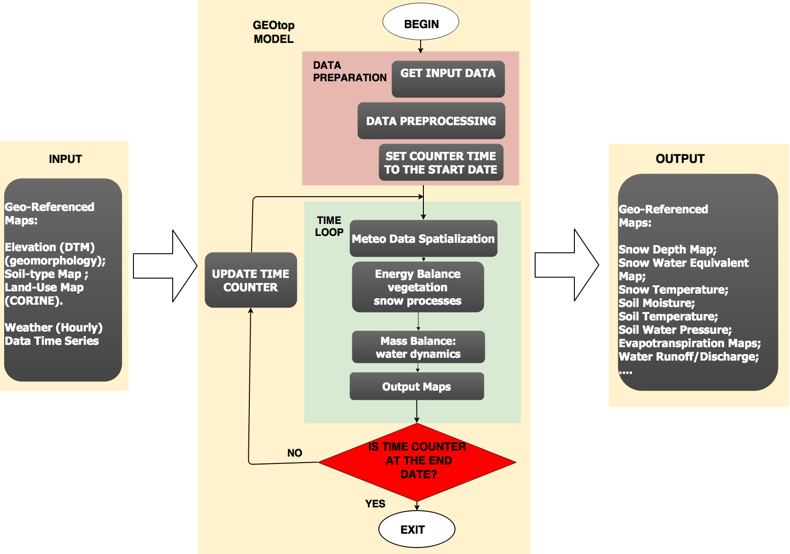{width=100%}\
\endcol

\begincol{.30\textwidth}

- **Input**: meteo data, elevations, soil parameters,...

- **Output**: snow cover, soil temperature, soil moisture,...

\endcol
\endcols


## Soil Water Pressure Head at P2 and B2 

```{r,echo=FALSE,return=TRUE,warning=FALSE,results="hide",message=FALSE,fig.height=5,fig.cap=""}
##tz <- "Etc/GMT-1"
when <- when_b2
psi_B2  <- get.geotop.inpts.keyword.value(
  "SoilLiqWaterPressProfileFile",
  wpath = wpath_B2,
  data.frame = TRUE,
  date_field = "Date12.DDMMYYYYhhmm.",
  tz = tz,
  zlayer.formatter = "z%04d"
)

##wpath_P2 <- "resources/simulation/Matsch_P2_Ref_007" 
psi_P2  <- get.geotop.inpts.keyword.value(
  "SoilLiqWaterPressProfileFile",
  wpath = wpath_P2,
  data.frame = TRUE,
  date_field = "Date12.DDMMYYYYhhmm.",
  tz = "Etc/GMT-1",
  zlayer.formatter = "z%04d")
  

psi_B2 <- cbind(time=as.POSIXct(index(psi_B2)),as.data.frame(psi_B2))
psi_P2 <- cbind(time=as.POSIXct(index(psi_P2)),as.data.frame(psi_P2))

psi_B2a <- psi_B2[as.Date(psi_B2$time) %in% when_b2,]
psi_P2a <- psi_P2[as.Date(psi_P2$time) %in% when_b2,]


psi_B2a$site <- "B2"
psi_P2a$site <- "P2"
psi_B2m <- melt(psi_B2a,id=c("time","site"))
psi_P2m <- melt(psi_P2a,id=c("time","site"))

psi <- rbind(psi_B2m,psi_P2m)
psi <- psi[psi$variable %in% depths,]

gpsi <- ggplot(psi, aes(x = time, y = value)) + 
   geom_line(aes(color = variable, fill = variable, linetype=site), 
             position = position_dodge(0.8))+theme_bw() +  theme(text = element_text(size=15))+xlab("Time")+ylab("Soil Water Pressure Head [mm]") 
 gpsi <- gpsi+scale_color_manual(values=rainbow(length(depths)),labels=hudepths[depths])

show(gpsi)

```

## Example of an Output Data Analytics (Soil Moisture Distribution)

Distribution of daily aggregated soil water contant  at a 18 cm depth:
```{r,echo=FALSE,return=TRUE,warning=FALSE,results="hide",message=FALSE,fig.height=4,fig.cap=""}
## Box Plot
time <- SWC_B2$time
SWC_B2_18cm <- SWC_B2[,"z0018"]
SWC_P2_18cm <- SWC_P2[,"z0018"]
## Daily Aggregation
SWC_B2_18cm_aggr <- tapply(X=SWC_B2_18cm,INDEX=as.Date(SWC_B2$time), FUN=median)

SWC_P2_18cm_aggr <- tapply(X=SWC_P2_18cm,INDEX=as.Date(SWC_P2$time), FUN=median)

cond <- all(names(SWC_B2_18cm_aggr)==names(SWC_P2_18cm_aggr))
if (!cond) stop("Mismacth dates between B2 and P2")
months <- as.character(as.Date(names(SWC_B2_18cm_aggr)),format="%m-%Y")
df <- data.frame(month=months,P2=as.vector(SWC_P2_18cm_aggr),B2=as.vector(SWC_B2_18cm_aggr))
dfp <- df[df$month %in% c("08-2010","08-2011","08-2012","08-2013","08-2014"),]
dfpm <- melt(dfp,id="month")
SWC_Boxplot <- ggplot(dfpm, aes(x=as.factor(month), y=value))+geom_boxplot()
SWC_Boxplot <- SWC_Boxplot+ggtitle("Box Plot: Daily Soil Water Content")+ylab("SWC")+xlab("")+theme_bw()+facet_grid(. ~ variable)+theme(text = element_text(size=15))+xlab("Time")
show(SWC_Boxplot)
```   

More details on the [__eRum2018__ poster](https://github.com/ecor/geotopbricks_doc/blob/master/erum2018_poster/erum2018_poster_cordano_et_al.png). 


