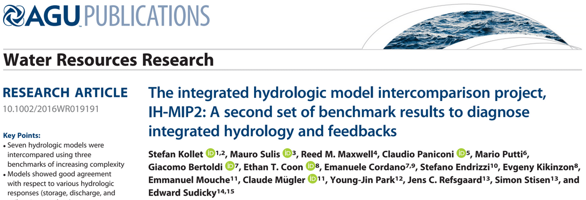

```{r setup, include=FALSE}
knitr::opts_chunk$set(eval = TRUE)
library(geotopbricks)
```

## Who are we?

- Environmental engineer with hydraulic and hydrological background (more deterministic and physicall-based than statics!)
- Some skills in programming and a R entusiast which I use to work with hydro-climatic data. 
- Find me as @ecor on GitHub 
- I'm self-employed and freelancer as www.rendena100.eu .  
- Author of several R-packages and p

- the other authors?

- Hydrologist ,,, BLA elisa, Giaomo
- Author of several packages, including `geotop`,...
- inserire immagini degli autori


## Hydrology

Scientific study of the movement, distribution, and quality of water on Earth water cycle, water resources and environmental watershed sustainability (REF)

<!-- \hspace*{-1cm}\includegraphics[width=1\paperwidth]{resources/images/geotop_draw.png} -->
{width=50%} 

## Hydrolgical models
-metti slides Tione che spiega cosa sono in modelli

## GEOtop Hydrological Model

GEOtop is an open-source integrated hydrological model that simulates:
\begin{itemize}
\item water flow in the soil $\,\to\,$ Richards' eq (sub) + Kinematic eq (sur)
\item energy exchange with the atmosphere $\,\to\,$ full integration of equation
\end{itemize}
Metti alcune referenze + link github

{width=20%}
{width=20%}
{width=20%}


## Hydrological Model Structure


- Input: meteo data, elevations, soil parameters
- Output: snow cover, soil temperature, soil moisture
- Semplifica il grafico con solo input e output e processi principali

{width=90%}
## GEOtop model}%{Optional Subtitle

Water and energy budgets can be activated :

- one or the other $\,\to\,$ simplification
- both them together $\,\to\,$ realistic

Two setup configurations :
- __1D__: only vertical fluxes $\,\to\,$ mass and energy balance at local scale (only in one soil column)
- __3D__: vertical and lateral fluxes $\,\to\,$ balances at basin scale

{width=90%}


Core components of GEOtop software packages are: 

- written in C/C++
- released in 2014 (version 2.0) as free open-source project, a re-engineering process is going to finish (version 3.0); 
- scientifically tested and published;
- documented on GitHub repository: *http://geotopmodel.github.io/geotop/*

{width=90%}
<!-- \begin{center} -->
<!-- Scientific quality of the project but still missing \\ -->
<!-- a \textbf{modern software engineering approach!} -->
<!-- \end{center} -->

<!-- % mettere,se ci sta, anche il grafico con i papers pubblicati “20 years of dev …” -->

## Motivations

- complex  outputs data difficult to manage
- need of user friendly tools to posprocess outptuts and extract information
- When outputs are in R then you can use all his data analyisis power
- we need an interface, and we use R !


## GEOtop configuration File (geotop.inpts)

A GEOtop simulation is organized in a set of files within a directory.

- A smart keywords system for defining all configuration parameters:
  - Pro: very flexible I/O configrations
  - Contra: difficult to manage without a proper interface

This directory contains: 

-**input files** (meteorological forcings,
topography, land-use, soil-type maps, initial conditions); **target
information** (which results are requested) ; 
- **observations**. 
Allthese information are written in a file called `geotop.inpts`, which is
a list of **keyword-value** pairs:


```
InitDateDDMMYYYYhhmm    =   09/04/2014 18:00  
EndDateDDMMYYYYhhmm     =   01/01/2016 00:00 
[...] 
MeteoFile               =   "meteoB2_irr" 
PointOutputFile         =   "tabs/point" 
```


## Approach: GEOtopbriks
Geotopbricks a GEOtop R interface:

It provides
- parsing of the configuration files
- customo R function to import ouptuput time series as zoo objects
- maps time series are imported as multitemporal raster objects
- vedi poster


Graph
<!-- # ```{r,fig.height=8, fig.width=6,echo=FALSE,results="hide",collapse=TRUE,warning=FALSE,message=FALSE} -->

```{r,echo=FALSE,results="hide",collapse=TRUE,warning=FALSE,message=FALSE}
#!/usr/bin/env Rscript
# file appendSmetData.R
#
# This script creates a graph of the package function and thair main external depencies
#
# author: Emanuele Cordano on 09-09-2015

#This program is free software: you can redistribute it and/or modify
#it under the terms of the GNU General Public License as published by
#the Free Software Foundation, either version 3 of the License, or
#(at your option) any later version.
#
#This program is distributed in the hope that it will be useful,
#but WITHOUT ANY WARRANTY; without even the implied warranty of
#MERCHANTABILITY or FITNESS FOR A PARTICULAR PURPOSE.  See the
#GNU General Public License for more details.
#
#You should have received a copy of the GNU General Public License
#along with this program.  If not, see <http://www.gnu.org/licenses/>.

###############################################################################
##rm(list=ls())
library(igraph)
set.seed(123)
list_envs <- list(environment(rasterFromOutput2DMap),
                  environment(writeLines),
                  environment(read.table),environment(terrain))
names(list_envs) <- c("geotopbricks","base","utils","raster")
color <- c("green","blue","orange","yellow") ###,"white","brown")
names(color) <- names(list_envs)

list_names <- lapply(X=list_envs,FUN=function(x){ls(env=x)})
list_df <- list()

for (it in names(list_envs)) {
	
		list_df[[it]]	<- data.frame(funx=list_names[[it]],env=it,color=color[it],stringsAsFactors=FALSE)
	
	
}
df <- do.call(what=rbind,args=list_df)

##### SEMPLIFICATE DF

onlyfun <- list(hydroGOF=c("gof"),hydroPSO=c("hydroPSO","lhoat"),geotopbricks=c("declared.geotop.inpts.keywords","rasterFromOutput2DMap","brickFromOutputSoil3DTensor","get.geotop.inpts.keyword.value"),
		base=c("writeLines","readLines"),utils=c("read.table"),raster=c("brick","raster","stack")) ### read.table was removed

for (it in names(onlyfun)) {
	
	cond  <- ((df$env==it) & (df$funx %in% onlyfun[[it]])) | (df$env!=it)
	df    <- df[cond,]
	
	
}		


fun_names <- df$funx
		

names(fun_names) <- fun_names

########################################
########################################
########################################
########################################
########################################
lfunx <- lapply(X=fun_names,FUN=function(x,nx) {
			o <- try(get(x),silent=TRUE)
			
			if (class(o)=="try-error") {
				
				o <- NA ### "It looks like a method!"
				return(o)
				
			}
			o <- formals(o)
		
			o <- lapply(X=o,FUN=as.character)
			
			o <- unlist(o)
			
			
			o <- o[o %in% nx]
			
			src <-  as.character(body(x))
			src <-  unlist(str_split(src, boundary("word")))
			nx <-  src[src %in% nx]
		
			o <- c(o,nx)
			o <- unique(o)
			
			
			
			
			return(o)
		
		},nx=fun_names)


for (it in names(lfunx)) {
	
	temp <- lfunx[[it]]
	ii <- which(temp!=it)
	temp <- temp[ii]
	nl <- length(temp)
	lfunx[[it]] <- array(c(rep(it,nl),temp),c(nl,2))
	
}
#####edges
edges <- do.call(rbind,lfunx)
vertices <- unique(edges)
#####
env_base <- "base;utils"
df$env[df$env=="base"]  <- env_base
df$env[df$env=="utils"] <- env_base
df$color[df$env==env_base] <- "white"
#####
color_ <- df$color
env_   <- df$env
names(color_) <- df$funx
names(env_) <- df$funx
######
gg <- graph_from_edgelist(edges)
vnames <- V(gg)$name
V(gg)$color <- color_[vnames]
vcodes <- sprintf("%02d",1:length(vnames))
names(vcodes) <- vnames
V(gg)$name <- vcodes
main <- "geotopOptim2  Internal Functions"
plot(gg,main=main)
legend("bottomleft",legend=unique(env_),fill=unique(color_),ncol=2)
legend("topleft",legend=paste(vcodes,vnames,sep=" : "),ncol=3,cex=0.6)
#pp <- png::readPNG('resources/images/geotopoptim_v2.png')
#xleft <- 1
#xright <- xleft+ncol(pp)-1
#ybottom = 0
#ytop= ybottom+nrow(pp)-1
#rasterImage(pp, xleft=xleft, ybottom=ybottom,xright=xright,ytop=ytop, angle = 0, interpolate = FALSE)

```

## Simulation of soil water budget in an alpine site


GOtop is applied to estimate soil water content in two soil columns below  two hydro-meteorological stations (B2 and P2) located in Val Mazia/Match, Malles Venosta/Mals Vinschgau, in South Tyrol, Italy (LOng Term Reasearch Ecological Area, [http://lter.eurac.edu/en]).
  
 {width=40%} 
<!--CHANGE THE FIGUE !!! -->


## Simulation of soil water budget in an alpine site

Here is the directory containing files of B2 point simulation: 
```{r,echo=TRUE,return=FALSE}
library(geotopbricks) 

## SET GEOTOP WORKING DIRECTORY
wpath_B2 <- "resources/simulation/Matsch_B2_Ref_007" 
##writeLines(list.files(wpath_B2))
```

## Getting simulation input data

Meteorological variable time series are imported and saved as 'meteo' variable (class 'zoo'). This variable is retrieved through the GEOtop keyword  __MeteoFile__ : 

```{r,echo=TRUE,return=TRUE}
tz <- "Etc/GMT-1"
meteo <- get.geotop.inpts.keyword.value(
  "MeteoFile",
  wpath=wpath_B2,
  data.frame=TRUE,
  tz=tz)
class(meteo)
```

## Verifying that import of simulation input data has succeed 

Meteorological time series once imported are available in the R environment:
```{r,echo=TRUE,return=TRUE}
head(meteo[12:14,c("Iprec","WindSp","WindDir")])
head(meteo[12:14,c("RelHum","AirT","Swglobal")])
```

## Plotting 

```{r,echo=FALSE,return=TRUE}
library(ggplot2)
library(reshape2)
library(lubridate)
meteo_df <- as.data.frame(meteo)
nvars <- c("Iprec","WindSp","WindDir","RelHum","AirT","Swglobal")
meteo_df$time <- as.POSIXct(index(meteo))
cols <- c("time","Iprec","WindSp","WindDir","RelHum","AirT","Swglobal")
offset <- array(0,length(cols))
names(offset) <- cols
multp <- array(1,length(cols))
names(multp) <- cols

offset["AirT"] <- 0
multp["Swglobal"] <- 50
multp["Iprec"] <- 0.1
when <- as.Date("2010-05-10")+days(0:10)
iwhen <- as.Date(meteo_df$time) %in% when

cols_ <- c("AirT","Iprec")

meteo_df <- meteo_df[iwhen,c("time",cols_)]
itref <- "Iprec"
itnoref <- cols_[cols_!=itref][1]

for (it in cols_) {
  meteo_df[,it] <- (meteo_df[,it]-offset[it]) / multp[it]
  meteo_df[,it] <- meteo_df[,it]*multp[itref]+offset[itref]
}

a <- multp[itnoref]/multp[itref]
b <- offset[itnoref]-a*offset[itref]

meteo_dfm <- melt(meteo_df,id="time")
gp <- ggplot(meteo_dfm, aes(x = time, y = value)) + 
   geom_area(aes(color = variable, fill = variable, alpha=variable), 
             position = position_dodge(0.8)) +
   scale_color_manual(values = c("red", "blue")) +
   scale_fill_manual(values = c("red", "blue"))+
   scale_alpha_manual(values= c(0.1,0.5))+theme_bw()+
  scale_y_continuous(
    "Precipitation", 
    sec.axis = sec_axis(~ . * a+b, name = "AirT")
  )
gp
```

## Getting output simulation data

Soil Water Content Profile: 
```{r,echo=TRUE,return=FALSE}
tz <- "Etc/GMT-1"
SWC_B2  <- get.geotop.inpts.keyword.value(
  "SoilLiqContentProfileFile",
  wpath = wpath_B2,
  data.frame = TRUE,
  date_field = "Date12.DDMMYYYYhhmm.",
  tz = tz,
  zlayer.formatter = "z%04d"
)
help(get.geotop.inpts.keyword.value) ## for more details!
```

## P2 

The same for P2:
```{r,echo=TRUE,return=FALSE}
wpath_P2 <- "resources/simulation/Matsch_P2_Ref_007" 
SWC_P2  <- get.geotop.inpts.keyword.value(
  "SoilLiqContentProfileFile",
  wpath = wpath_P2,
  data.frame = TRUE,
  date_field = "Date12.DDMMYYYYhhmm.",
  tz = "Etc/GMT-1",
  zlayer.formatter = "z%04d")
  

```

## Data Reformatting

```{r,echo=TRUE}
class(SWC_B2)
```

```{r,echo=TRUE}
SWC_B2 <- cbind(time=as.POSIXct(index(SWC_B2)),as.data.frame(SWC_B2))
SWC_P2 <- cbind(time=as.POSIXct(index(SWC_P2)),as.data.frame(SWC_P2))
class(SWC_B2)
names(SWC_B2)
###knitr::kable(head(SWC_B2))
```

## Output Visualization 

```{r,echo=FALSE,eval=TRUE,return=FALSE,warning=FALSE}
## http://www.sthda.com/english/wiki/ggplot2-line-types-how-to-change-line-types-of-a-graph-in-r-software
SWC_B2a <- SWC_B2[as.Date(SWC_B2$time) %in% when,]
SWC_P2a <- SWC_P2[as.Date(SWC_P2$time) %in% when,]
depths <- sprintf("z%04d",c(3,9,18,45))
SWC_B2a$site <- "B2"
SWC_P2a$site <- "P2"
SWC_B2m <- melt(SWC_B2a,id=c("time","site"))
SWC_P2m <- melt(SWC_P2a,id=c("time","site"))

SWC <- rbind(SWC_B2m,SWC_P2m)
SWC <- SWC[SWC$variable %in% depths,]

gswc <- ggplot(SWC, aes(x = time, y = value)) + 
   geom_line(aes(color = variable, fill = variable, linetype=site), 
             position = position_dodge(0.8))+theme_bw() #+

show(gswc)

```

## Analysis (soil Mooisture Distribution)

Soil Water Content Distributio at a 18 cm depth
```{r,echo=FALSE,warning=FALSE,eval=TRUE}
## Box Plot
time <- SWC_B2$time
SWC_B2_18cm <- SWC_B2[,"z0018"]
SWC_P2_18cm <- SWC_P2[,"z0018"]
## Daily Aggregation
SWC_B2_18cm_aggr <- tapply(X=SWC_B2_18cm,INDEX=as.Date(SWC_B2$time), FUN=median)

SWC_P2_18cm_aggr <- tapply(X=SWC_P2_18cm,INDEX=as.Date(SWC_P2$time), FUN=median)

cond <- all(names(SWC_B2_18cm_aggr)==names(SWC_P2_18cm_aggr))
if (!cond) stop("Mismacth dates between B2 and P2")
months <- as.character(as.Date(names(SWC_B2_18cm_aggr)),format="%m-%Y")
df <- data.frame(month=months,P2=as.vector(SWC_P2_18cm_aggr),B2=as.vector(SWC_B2_18cm_aggr))
dfp <- df[df$month %in% c("08-2010","08-2011","08-2012","08-2013","08-2014"),]
dfpm <- melt(dfp,id="month")
SWC_Boxplot <- ggplot(dfpm, aes(x=as.factor(month), y=value))+geom_boxplot()
SWC_Boxplot <- SWC_Boxplot+ggtitle("Box Plot: Daily Soil Water Content")+ylab("SWC")+xlab("")+theme_bw()+facet_grid(. ~ variable)
show(SWC_Boxplot)
```   


## And Precipitation: 

?


## 3D Spatially Distributed Distribution (Vinschgau - Upper Adige River Basin - Alps - I/CH/A)

```{r,echo=TRUE,eval=TRUE,return=FALSE,warning=FALSE}

wpath_3D <- 'resources/simulation/Vinschgau_test_3D_002'
basin <- get.geotop.inpts.keyword.value("LandCoverMapFile",
              wpath=wpath_3D,raster=TRUE)
basin
```

##  3D Spatially Distributed Distribution (Input Geospatial Map)

```{r,echo=FALSE,eval=TRUE,return=FALSE,warning=FALSE,fig.height=5}
URL = 'https://{s}.tile.opentopomap.org/{z}/{x}/{y}.png'
ATTRIBUTION = 'Map data: &copy; <a href="http://www.openstreetmap.org/copyright">OpenStreetMap</a>, <a href="http://viewfinderpanoramas.org">SRTM</a> | Map style: &copy; <a href="https://opentopomap.org">OpenTopoMap</a> (<a href="https://creativecommons.org/licenses/by-sa/3.0/">CC-BY-SA</a>)'
library(leaflet)

basin <- get.geotop.inpts.keyword.value("DemFile",wpath=wpath_3D,raster=TRUE)
color <- colorNumeric("BrBG",domain=basin[],na.color="transparent",reverse = TRUE) ## http://colorbrewer2.org
opacity <- 0.8

meteoloc <- data.frame(x=get.geotop.inpts.keyword.value("MeteoStationCoordinateX",wpath=wpath_3D,numeric=TRUE))
meteoloc$y <- get.geotop.inpts.keyword.value("MeteoStationCoordinateY",wpath=wpath_3D,numeric=TRUE)
coordinates(meteoloc) <- ~ x+y 
projection(meteoloc) <- projection(basin)
meteoloc <- spTransform(meteoloc,CRSobj="+proj=longlat +ellps=WGS84 +datum=WGS84 +no_defs")
meteoloc <- as.data.frame(meteoloc)
#leaf_psi <- leaf1 %>% addRasterImage(theta,color=color,opacity=opacity) %>% 
#addLegend(position="bottomright",pal=color,values=theta[],opacity=opacity,title="Psi") %>% #addMarkers(lng=points$lon,lat=points$lat,label=points$name)

#leaf_psi
leaf <- leaflet() %>% addTiles(urlTemplate=URL,attribution=ATTRIBUTION) 
leaf %>% addRasterImage(basin,opacity=opacity,col=color) %>% addLegend(position="bottomright",pal=color,values=basin[],opacity=opacity,title="Elevation [m]") %>% 
addCircleMarkers(lng=meteoloc$x,lat=meteoloc$y,label="Meteo",opacity=opacity,radius=2,color="red") %>% 
  addScaleBar()


```

## LOREM IPSUM 
<!-- ```{r,echo=FALSE,eval=TRUE} -->
<!-- show(prec_Boxplot) -->
<!-- ``` -->
<!-- </center> -->
The results show than B2 is able to hold more water than P2. This depends on soil and land properties. Compared with input precipiation results,soil water behaviour for the different months is related to precipitation amount (depth and number of rainy days). Interestingly, in August 2014 soil water content is higher than in August 2012,  in which precipitaion is higher. However, in August 2014 the daily precipitation distribution is the least wide with the lowest variability (interquantile range) and two extreme events. (Precipiation time series in B2 and P2 are equal due to their short distance!)


Hydrological models are solvers of the differantial equations of water flows and water thermodymanics in the Earth associated to heat transfers between Earth and the low atmosphere. They are a simplification of a real-world system
useful to understand, predict, manage water resources. 
”integrated”


<!-- ## {.plain} -->
<!-- \hspace*{-1cm}\includegraphics[width=1\paperwidth]{IMAGE} -->

## Dicussion
- open science
- reproducibuly of modelling simulations
- fair priciple


## Conclusion and forward


- open source hydrolgical models need powerful processing interface

- tool for popsptocesing GEOtop

- getting your data in the right shape (e.g. `tidyverse`, `recipes`)

- potential for extension for ohter models

- for oprational aplications / engineering productivity

- enlarge communtiy


vedi abstract


## Interested?

www.geotop.org
<!-- \begin{minipage}[c]{0.5\textwidth} -->
<!-- \includegraphics[width=0.9\textwidth]{img/SDCR.jpg}  -->
<!-- \end{minipage} -->
<!-- \begin{minipage}[c]{0.5\textwidth} -->
<!-- \begin{block}{SDCR} -->
<!-- M. van der Loo and E. de Jonge (2018) -->
<!-- \emph{Statistical Data Cleaning with applications in R} -->
<!-- Wiley, Inc. -->
<!-- \end{block} -->
<!-- \begin{block}{validatetools} -->
<!-- \begin{itemize} -->
<!-- \item Available on \href{https://CRAN.R-project.org/package=validatetools}{\underline{CRAN}} -->
<!-- \end{itemize} -->
<!-- \end{block} -->
<!-- \begin{block}{More theory?} -->
<!-- $\leftarrow$ See book  -->
<!-- \end{block} -->
<!-- \end{minipage} -->

- link CRAN e github repository

Thank you for your attention! / Merci pour votre attention!  


## Addendum

LOREM IPSUM

