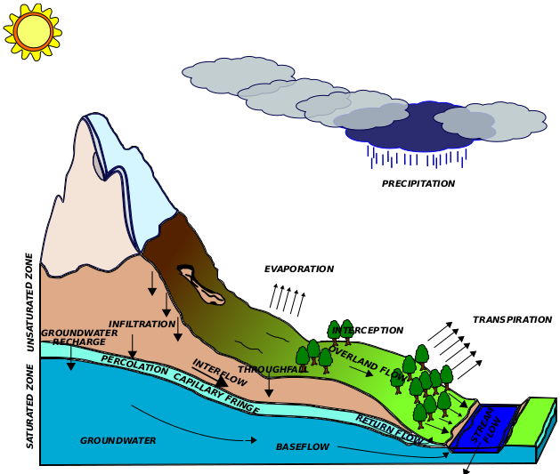
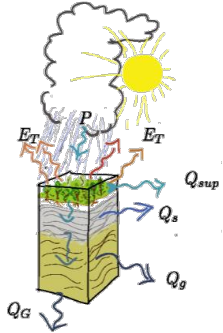
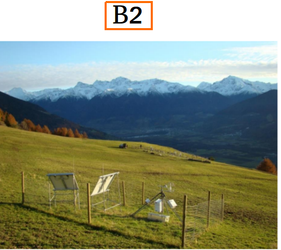
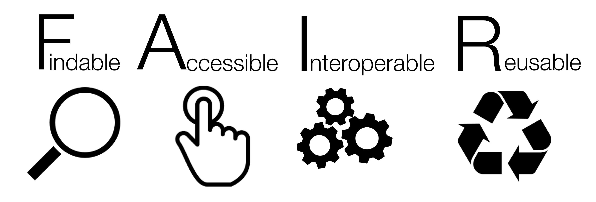

```{r setup, include=FALSE}
knitr::opts_chunk$set(eval = TRUE)
knitr::opts_chunk$set(fig.cap = FALSE)
knitr::opts_knit$set(fig.cap = FALSE)
knitr::opts_template$set(fig.cap = FALSE)
knitr::opts_knit$set(unnamed.chunk.label = "fig")
library(geotopbricks)
```

## Who are we?

\begincols

\begincol{0.2\textwidth} 


{width=90%}\ 

{width=90%}\
{width=90%}\
\endcol

\begincol{0.7\textwidth}

- Environmental engineers with hydraulic and hydrological background (more deterministic and physicall-based than statics!)
- Some of us are resercher, other are self-employed and freelancers - www.rendena100.eu .  
- Some of us are author of several R-packages and R enthusiast. 
- Some of us are developers of GEOtop hydrologic models with skills in hydrology and environmental science and also in C/C++, parallell programming, High Perfomance Computing, etc

\endcol

\endcols

## Hydrology

Scientific study of the movement, distribution, and quality of water on Earth water cycle, water resources and environmental watershed sustainability [_Wikipedia_]

<!-- \hspace*{-1cm}\includegraphics[width=1\paperwidth]{resources/images/geotop_draw.png} -->
{width=50%} 

## Hydrolgical models

\begincols
  \begincol{.48\textwidth}

  {width=100%}\ 

  \endcol
\begincol{.48\textwidth}
\begincols
  \begincol{.48\textwidth}
 {width=100%}\
 
 
 {width=100%}\
\endcol
\begincol{.48\textwidth}
{width=100%}\
    \endcol
    \endcols
  \endcol
\endcols


## GEOtop Hydrological Model

GEOtop is an open-source integrated hydrological model, available though Github, [www.geotop.org](https://www.geotop.org), simulating:
\begincols

\begincol{.22\textwidth}
{width=100%}\
{width=100%}\
{width=100%}\
\endcol

\begincol{.77\textwidth}

- soil water flow in the soil (*Richards' equation,De Saint-Venant Equation)*; 

- heat flow in the soil $\,\to\,$ *(heat equation and frozen soil thermodynamics) *;

- energy exchange with the atmosphere $\,\to\,$  boundary conditions of the equations above.

\endcol
\endcols


## GEOtop Hydrological Model Structure

\begincols

\begincol{.69\textwidth}
{width=100%}\
\endcol

\begincol{.30\textwidth}

- **Input**: meteo data, elevations, soil parameters,...

- **Output**: snow cover, soil temperature, soil moisture,...

\endcol
\endcols

<!-- SISTEMARE FIGURA -->


## GEOtop Hydrological Model Options

Water and/or energy budgets can be activated (both or only one) by users in function of the specic use case.  GEOtop has two setup configurations :

- __1D__: only vertical fluxes $\,\to\,$ mass and energy balance at local scale (only in one soil column)

- __3D__: vertical and lateral fluxes $\,\to\,$ balances at basin scale

{width=80%}\


## GEOtop Hydrological Model Software Package / Source Code


Core components of GEOtop software packages are: 

- written in C/C++
- released in 2014 (version 2.0) as free open-source project, a re-engineering process is going to finish (version 3.0); 
- scientifically tested and published;

Source code and documentation are available on GitHub repository: [http://geotopmodel.github.io/geotop/].

{width=90%}\


## geotopbrick R package: Why? 

- complexity in input/output/configuration files (_"frontend"_) and data difficult to handle
- need of user friendly environment for to GEOtop data tidying and data analytics (e.g. _R_)
{width=90%}\


<!-- - potential interactions between hydrology (__GEOtop__) and other knowledge domains (_discipines_). -->


## GEOtop configuration File (geotop.inpts)

A GEOtop simulation is organized in a set of files within a directory containing a **configuration file** ,called _geotop.inpts_ filled with a keywords system addressing to:

\begincols
  \begincol{.30\textwidth}
  
- simulation options (e.g. simulation period)
- **input files** (e.g. meterological time series)
- **output files** 

  \endcol
   \begincol{.65\textwidth}
```
InitDateDDMMYYYYhhmm=09/04/2014 18:00  
EndDateDDMMYYYYhhmm =01/01/2016 00:00 
[...] 
MeteoFile           ="meteoB2_irr" 
PointOutputFile     ="tabs/point" 
```
\endcol
\endcols


## __geotopbricks__ Technical details

The aim of **geotopbricks** , starting in 2013, is to bring all the data of a GEOtop simulaton into the powerful statistical
**R** environment by using the `keyword-value` syntax of *geotop.inpts*. **geotopbricks** does the following actions:

- to parse _geotop.inpts_ configuration files;
- to derive from _geotop.inpts_'s keywords the source files of I/O data;
- to import time series (e.g. precipitation, temperature, soil water content, snow) as _zoo_ or _data.frame_ objects;
- to import spatially and spatio-temporal gridded objects as _RasterLayer-class_ or _RasterBrick-class_ objects (**raster** package) 

<!-- # ```{r,fig.height=8, fig.width=6,echo=FALSE,results="hide",collapse=TRUE,warning=FALSE,message=FALSE} -->

```{r,echo=FALSE,results="hide",collapse=TRUE,warning=FALSE,message=FALSE,eval=FALSE}
#!/usr/bin/env Rscript
# file appendSmetData.R
#
# This script creates a graph of the package function and thair main external depencies
#
# author: Emanuele Cordano on 09-09-2015

#This program is free software: you can redistribute it and/or modify
#it under the terms of the GNU General Public License as published by
#the Free Software Foundation, either version 3 of the License, or
#(at your option) any later version.
#
#This program is distributed in the hope that it will be useful,
#but WITHOUT ANY WARRANTY; without even the implied warranty of
#MERCHANTABILITY or FITNESS FOR A PARTICULAR PURPOSE.  See the
#GNU General Public License for more details.
#
#You should have received a copy of the GNU General Public License
#along with this program.  If not, see <http://www.gnu.org/licenses/>.

###############################################################################
##rm(list=ls())
library(igraph)
set.seed(123)
list_envs <- list(environment(rasterFromOutput2DMap),
                  environment(writeLines),
                  environment(read.table),environment(terrain))
names(list_envs) <- c("geotopbricks","base","utils","raster")
color <- c("green","blue","orange","yellow") ###,"white","brown")
names(color) <- names(list_envs)

list_names <- lapply(X=list_envs,FUN=function(x){ls(env=x)})
list_df <- list()

for (it in names(list_envs)) {
	
		list_df[[it]]	<- data.frame(funx=list_names[[it]],env=it,color=color[it],stringsAsFactors=FALSE)
	
	
}
df <- do.call(what=rbind,args=list_df)

##### SEMPLIFICATE DF

onlyfun <- list(hydroGOF=c("gof"),hydroPSO=c("hydroPSO","lhoat"),geotopbricks=c("declared.geotop.inpts.keywords","rasterFromOutput2DMap","brickFromOutputSoil3DTensor","get.geotop.inpts.keyword.value"),
		base=c("writeLines","readLines"),utils=c("read.table"),raster=c("brick","raster","stack")) ### read.table was removed

for (it in names(onlyfun)) {
	
	cond  <- ((df$env==it) & (df$funx %in% onlyfun[[it]])) | (df$env!=it)
	df    <- df[cond,]
	
	
}		


fun_names <- df$funx
		

names(fun_names) <- fun_names

########################################
########################################
########################################
########################################
########################################
lfunx <- lapply(X=fun_names,FUN=function(x,nx) {
			o <- try(get(x),silent=TRUE)
			
			if (class(o)=="try-error") {
				
				o <- NA ### "It looks like a method!"
				return(o)
				
			}
			o <- formals(o)
		
			o <- lapply(X=o,FUN=as.character)
			
			o <- unlist(o)
			
			
			o <- o[o %in% nx]
			
			src <-  as.character(body(x))
			src <-  unlist(str_split(src, boundary("word")))
			nx <-  src[src %in% nx]
		
			o <- c(o,nx)
			o <- unique(o)
			
			
			
			
			return(o)
		
		},nx=fun_names)


for (it in names(lfunx)) {
	
	temp <- lfunx[[it]]
	ii <- which(temp!=it)
	temp <- temp[ii]
	nl <- length(temp)
	lfunx[[it]] <- array(c(rep(it,nl),temp),c(nl,2))
	
}
#####edges
edges <- do.call(rbind,lfunx)
vertices <- unique(edges)
#####
env_base <- "base;utils"
df$env[df$env=="base"]  <- env_base
df$env[df$env=="utils"] <- env_base
df$color[df$env==env_base] <- "white"
#####
color_ <- df$color
env_   <- df$env
names(color_) <- df$funx
names(env_) <- df$funx
######
gg <- graph_from_edgelist(edges)
vnames <- V(gg)$name
V(gg)$color <- color_[vnames]
vcodes <- sprintf("%02d",1:length(vnames))
names(vcodes) <- vnames
V(gg)$name <- vcodes
main <- "geotopOptim2  Internal Functions"
plot(gg,main=main)
legend("bottomleft",legend=unique(env_),fill=unique(color_),ncol=2)
legend("topleft",legend=paste(vcodes,vnames,sep=" : "),ncol=3,cex=0.6)
#pp <- png::readPNG('resources/images/geotopoptim_v2.png')
#xleft <- 1
#xright <- xleft+ncol(pp)-1
#ybottom = 0
#ytop= ybottom+nrow(pp)-1
#rasterImage(pp, xleft=xleft, ybottom=ybottom,xright=xright,ytop=ytop, angle = 0, interpolate = FALSE)

```

## __geotopbriccks__ Application 1: Simulation of soil water budget in an alpine site
Soil water content (SWC) in two sites P2 and B2, located in Val Mazia/Match, Malles Venosta/Mals Vinschgau, in South Tyrol, Italy [http://lter.eurac.edu/en].
\begincols

\begincol{0.30\textwidth}
 {width=100%}\
 {width=100%}\
\endcol
\begincol{0.30\textwidth}
{width=100%}\
\endcol
\begincol{0.40\textwidth}
 
 {width=100%}\
 \endcol
 \endcols
 
 
 
 
<!--CHANGE THE FIGUE !!! -->


## Simulation of soil water budget in an alpine site

Here is the directory containing files of B2 point simulation: 
```{r,echo=TRUE,return=FALSE}
library(geotopbricks) 

## SET GEOTOP WORKING DIRECTORY
wpath_B2 <- "resources/simulation/Matsch_B2_Ref_007" 
##writeLines(list.files(wpath_B2))
```

## Getting simulation input data

Meteorological variable time series are imported and saved as 'meteo' variable (class 'zoo'). This variable is retrieved through the GEOtop keyword  __MeteoFile__ : 

```{r,echo=TRUE,return=TRUE}
tz <- "Etc/GMT-1"
meteo <- get.geotop.inpts.keyword.value(
  "MeteoFile",
  wpath=wpath_B2,
  data.frame=TRUE,
  tz=tz)
class(meteo)
```

## Getting simulation input data (verify)

Meteorological time series once imported are available in the R environment:
```{r,echo=TRUE,return=TRUE}
head(meteo[12:14,c("Iprec","AirT","Swglobal")])
```
```{r,echo=TRUE,eval=FALSE}
head(meteo[12:14,c("RelHum","WindSp","WindDir")])
```


## Plots of weather variables in B2 

```{r,echo=FALSE,return=TRUE,warning=FALSE,results="hide",message=FALSE,fig.height=5,fig.cap=""}
library(ggplot2)
library(reshape2)
library(lubridate)
meteo_df <- as.data.frame(meteo)
nvars <- c("Iprec","WindSp","WindDir","RelHum","AirT","Swglobal")
meteo_df$time <- as.POSIXct(index(meteo))
cols <- c("time","Iprec","WindSp","WindDir","RelHum","AirT","Swglobal")
offset <- array(0,length(cols))
names(offset) <- cols
multp <- array(1,length(cols))
names(multp) <- cols

offset["AirT"] <- 0
multp["Swglobal"] <- 50
multp["Iprec"] <- 0.1
when <- as.Date("2010-05-10")+days(0:10)
iwhen <- as.Date(meteo_df$time) %in% when
###
cols_ <- c("AirT","Iprec")
variables <- c("Air Temperature","Precipitation Intensity")
names(variables) <- cols_
fills <- c("red", "blue")
names(fills) <- cols_
alphas <- c(0.1,0.5)
names(alphas) <- cols_
####


meteo_df <- meteo_df[iwhen,c("time",cols_)]
meteo_df0 <- meteo_df
itref <- "Iprec"
itnoref <- cols_[cols_!=itref][1]

for (it in cols_) {
  meteo_df[,it] <- (meteo_df[,it]-offset[it]) / multp[it]
  meteo_df[,it] <- meteo_df[,it]*multp[itref]+offset[itref]
}

a <- multp[itnoref]/multp[itref]
b <- offset[itnoref]-a*offset[itref]

meteo_dfm <- melt(meteo_df,id="time")
gp <- ggplot(meteo_dfm, aes(x = time, y = value)) + 
   geom_area(aes(color = variable, fill = variable, alpha=variable), 
             position = position_dodge(0.8)) +
   scale_color_manual(values = fills[cols_],labels=variables[cols_]) +
   scale_fill_manual(values = fills[cols_],labels=variables[cols_])+
   scale_alpha_manual(values= alphas[cols_],labels=variables[cols_])+theme_bw()+
  scale_y_continuous(
    "Precipitation Intensity [mm/hr]", 
    sec.axis = sec_axis(~ . * a+b, name = "Air Temperature [C deg]")
  )+ggtitle("Air Temperature / Precipiation Intensity vs Time at B2")+
  theme(text = element_text(size=15))+xlab("Time")
gp
```

## Getting output simulation data at B2

Soil Water Content Profile: 
```{r,echo=TRUE,return=FALSE}
tz <- "Etc/GMT-1"
SWC_B2  <- get.geotop.inpts.keyword.value(
  "SoilLiqContentProfileFile",
  wpath = wpath_B2,
  data.frame = TRUE,
  date_field = "Date12.DDMMYYYYhhmm.",
  tz = tz,
  zlayer.formatter = "z%04d"
)
help(get.geotop.inpts.keyword.value) ## for more details!
```

## Getting output simulation data at P2

The same for P2:
```{r,echo=TRUE,return=FALSE}
wpath_P2 <- "resources/simulation/Matsch_P2_Ref_007" 
SWC_P2  <- get.geotop.inpts.keyword.value(
  "SoilLiqContentProfileFile",
  wpath = wpath_P2,
  data.frame = TRUE,
  date_field = "Date12.DDMMYYYYhhmm.",
  tz = "Etc/GMT-1",
  zlayer.formatter = "z%04d")
  

```


```{r,echo=FALSE,eval=TRUE,return=FALSE,warning=FALSE,results='hide'}
class(SWC_B2)
```

```{r,echo=FALSE,eval=TRUE,return=FALSE,warning=FALSE,results='hide'}
SWC_B2 <- cbind(time=as.POSIXct(index(SWC_B2)),as.data.frame(SWC_B2))
SWC_P2 <- cbind(time=as.POSIXct(index(SWC_P2)),as.data.frame(SWC_P2))
class(SWC_B2)
names(SWC_B2)
###knitr::kable(head(SWC_B2))
```

## Soil Water Content at P2 and B2 

```{r,echo=FALSE,return=TRUE,warning=FALSE,results="hide",message=FALSE,fig.height=5,fig.cap=""}
## http://www.sthda.com/english/wiki/ggplot2-line-types-how-to-change-line-types-of-a-graph-in-r-software
SWC_B2a <- SWC_B2[as.Date(SWC_B2$time) %in% when,]
SWC_P2a <- SWC_P2[as.Date(SWC_P2$time) %in% when,]
depths <- sprintf("z%04d",c(3,9,18,45))
SWC_B2a$site <- "B2"
SWC_P2a$site <- "P2"
SWC_B2m <- melt(SWC_B2a,id=c("time","site"))
SWC_P2m <- melt(SWC_P2a,id=c("time","site"))

SWC <- rbind(SWC_B2m,SWC_P2m)
SWC <- SWC[SWC$variable %in% depths,]

gswc <- ggplot(SWC, aes(x = time, y = value)) + 
   geom_line(aes(color = variable, fill = variable, linetype=site), 
             position = position_dodge(0.8))+theme_bw() +  theme(text = element_text(size=15))+xlab("Time") 

show(gswc)

```

## Output data Analytics (soil Mooisture Distribution)

Distribution of daily aggregated soil water contant  at a 18 cm depth:
```{r,echo=FALSE,warning=FALSE,eval=TRUE,fig.height=4}
## Box Plot
time <- SWC_B2$time
SWC_B2_18cm <- SWC_B2[,"z0018"]
SWC_P2_18cm <- SWC_P2[,"z0018"]
## Daily Aggregation
SWC_B2_18cm_aggr <- tapply(X=SWC_B2_18cm,INDEX=as.Date(SWC_B2$time), FUN=median)

SWC_P2_18cm_aggr <- tapply(X=SWC_P2_18cm,INDEX=as.Date(SWC_P2$time), FUN=median)

cond <- all(names(SWC_B2_18cm_aggr)==names(SWC_P2_18cm_aggr))
if (!cond) stop("Mismacth dates between B2 and P2")
months <- as.character(as.Date(names(SWC_B2_18cm_aggr)),format="%m-%Y")
df <- data.frame(month=months,P2=as.vector(SWC_P2_18cm_aggr),B2=as.vector(SWC_B2_18cm_aggr))
dfp <- df[df$month %in% c("08-2010","08-2011","08-2012","08-2013","08-2014"),]
dfpm <- melt(dfp,id="month")
SWC_Boxplot <- ggplot(dfpm, aes(x=as.factor(month), y=value))+geom_boxplot()
SWC_Boxplot <- SWC_Boxplot+ggtitle("Box Plot: Daily Soil Water Content")+ylab("SWC")+xlab("")+theme_bw()+facet_grid(. ~ variable)+theme(text = element_text(size=15))+xlab("Time")
show(SWC_Boxplot)
```   

More deetails on the [__eRum2018__ poster](https://github.com/ecor/geotopbricks_doc/blob/master/erum2018_poster/erum2018_poster_cordano_et_al.png). 


## 3D Spatially Distributed Distribution (Vinschgau - Upper Adige River Basin - Alps - I/CH/A)

```{r,echo=TRUE,eval=TRUE,return=FALSE,warning=FALSE}

###wpath_3D <- 'resources/simulation/Vinschgau_test_3D_002'
wpath_3D <- 'resources/simulation/Vinschgau'
basin <- get.geotop.inpts.keyword.value("LandCoverMapFile",
              wpath=wpath_3D,raster=TRUE)
basin
```

##  3D Spatially Distributed Simulation (Input Geospatial Map)

```{r,echo=FALSE,eval=TRUE,return=FALSE,warning=FALSE,fig.height=5}
URL = 'https://{s}.tile.opentopomap.org/{z}/{x}/{y}.png'
ATTRIBUTION = 'Map data: &copy; <a href="http://www.openstreetmap.org/copyright">OpenStreetMap</a>, <a href="http://viewfinderpanoramas.org">SRTM</a> | Map style: &copy; <a href="https://opentopomap.org">OpenTopoMap</a> (<a href="https://creativecommons.org/licenses/by-sa/3.0/">CC-BY-SA</a>)'
library(leaflet)

elevation <- get.geotop.inpts.keyword.value("DemFile",wpath=wpath_3D,raster=TRUE)
basin <- basin*0+elevation
color <- colorNumeric("BrBG",domain=basin[],na.color="transparent",reverse = TRUE) ## http://colorbrewer2.org
opacity <- 0.8

meteoloc <- data.frame(x=get.geotop.inpts.keyword.value("MeteoStationCoordinateX",wpath=wpath_3D,numeric=TRUE))
meteoloc$y <- get.geotop.inpts.keyword.value("MeteoStationCoordinateY",wpath=wpath_3D,numeric=TRUE)
coordinates(meteoloc) <- ~ x+y 
projection(meteoloc) <- projection(basin)
meteoloc <- spTransform(meteoloc,CRSobj="+proj=longlat +ellps=WGS84 +datum=WGS84 +no_defs")
meteoloc <- as.data.frame(meteoloc)
#leaf_psi <- leaf1 %>% addRasterImage(theta,color=color,opacity=opacity) %>% 
#addLegend(position="bottomright",pal=color,values=theta[],opacity=opacity,title="Psi") %>% #addMarkers(lng=points$lon,lat=points$lat,label=points$name)

#leaf_psi
leaf <- leaflet() %>% addTiles(urlTemplate=URL,attribution=ATTRIBUTION) 
leaf %>% addRasterImage(basin,opacity=opacity,col=color) %>% addLegend(position="bottomright",pal=color,values=basin[],opacity=opacity,title="Elevation [m]") %>% 
addCircleMarkers(lng=meteoloc$x,lat=meteoloc$y,label="Meteo",opacity=opacity,radius=2,color="red") %>% 
  addScaleBar()


```


## 3D Spatially Distributed Simulation (Output Geospatial Map): Soil Water Content

```{r eval=TRUE,echo=FALSE,message=FALSE,warning=FALSE,results='hide',fig.height=5}
library(RColorBrewer)
keyword <- 'SoilLiqContentTensorFile'
s <- get.geotop.inpts.keyword.value(keyword,wpath=wpath_3D)
start <-  get.geotop.inpts.keyword.value("InitDateDDMMYYYYhhmm",date=TRUE,wpath=wpath_3D,tz=tz) 
end <- get.geotop.inpts.keyword.value("EndDateDDMMYYYYhhmm",date=TRUE,wpath=wpath_3D,tz=tz) 

b <- brickFromOutputSoil3DTensor(x=keyword,when=end,wpath=wpath_3D,tz=tz)
##plot(b,col=heat.colors(10))
color_b <- colorRampPalette((brewer.pal(20,"PuBu")))
rasterVis::levelplot(b,margin=FALSE,col.regions=color_b,xlab=NULL,ylab=NULL,scales=list(draw=FALSE))
```

```{r eval=FALSE,echo=TRUE}

help("brickFromOutputSoil3DTensor") ## for more details

```

## 3D Spatially Distributed Simulation (Output Geospatial Map): Surface Water Discharga at the Outlet 

```{r eval=TRUE,echo=FALSE,message=FALSE,warning=FALSE,results='hide',fig.height=5}

dis <- get.geotop.inpts.keyword.value("DischargeFile",wpath=wpath_3D,data.frame=TRUE,formatter="",date_field="DATE.day.month.year.hour.min.",tz=tz)
bas <- get.geotop.inpts.keyword.value("BasinOutputFile",wpath=wpath_3D,data.frame=TRUE,formatter="",date_field="Date12.DDMMYYYYhhmm.",tz=tz)
##dygraphs::dygraph(dis$Qtot.m3.s.)

dis_df <- as.data.frame(dis)
dis_df$time <- as.POSIXct(index(dis))
bas_df <- as.data.frame(bas)
bas_df$time <- as.POSIXct(index(bas))
ndis <- c("time","Qtot.m3.s.")
nbas <- c("time","Pnet.mm.","Evap_surface.mm.","Transpiration_canopy.mm.")
dis_df  <- dis_df[,ndis]
bas_df  <- bas_df[,nbas]
cond <- all(dis_df$time==bas_df$time)
if (!cond) stop("Mismacth dates between bas_df and dis_df")
bas_df <- bas_df[,nbas[nbas!="time"]]
basin_results_df0 <- cbind(dis_df,bas_df)
dt0 <- as.numeric(diff(basin_results_df0$time)[1],unit="secs")
#### NON-dplyr DAILY AGGRAGATION
basin_results_df1 <- NULL
cols_ <- names(basin_results_df0)
cols_ <- cols_[cols_!="time"]
dates <- as.Date(basin_results_df0$time)
for (it in cols_) {
   
  val <- tapply(X=basin_results_df0[,it],INDEX=dates,FUN=mean,na.rm=TRUE)
  if (it==cols_[1]) {
    basin_results_df1 <- data.frame(time=as.Date(names(val)),stringsAsFactors = FALSE )
  }
  if (it!="Qtot.m3.s.")  val <- val/dt0*24*3600
  basin_results_df1[,it] <- val 
  
  
}

##library(dplyr)


```


```{r,echo=FALSE,return=TRUE,warning=FALSE,results="hide",message=FALSE,fig.height=5}
library(ggplot2)
library(reshape2)
library(lubridate)
basin_results_df <- basin_results_df1
basin_results_df["Pnet.mm."] <- -basin_results_df["Pnet.mm."]
cols <- names(basin_results_df)
offset <- array(0,length(cols))
names(offset) <- cols
multp <- array(1,length(cols))
names(multp) <- cols


### area basin
area <- length(which(!is.na(basin)[]))*xres(basin)*yres(basin)
dt <- as.numeric(diff(basin_results_df$time)[1],unit="secs")

#offset["AirT] <- 0
vmult <- 20
carea <- (area/(dt*1000)/vmult)^(-1)
multp["Pnet.mm."] <- carea
multp["Evap_surface.mm."] <- carea
multp["Transpiration_canopy.mm."] <- carea

itref <- "Qtot.m3.s."
itnoref <- "Pnet.mm."
multp[itref] <- 2
a <- multp[itnoref]/multp[itref]
offset[itnoref] <- -ceiling(max(abs(basin_results_df[,itref])))*a

b <- offset[itnoref]-a*offset[itref]
 


when <- as.Date("2010-11-01")+days(0:365)
iwhen <- as.Date(basin_results_df$time) %in% when

cols_ <- cols[cols!="time"] ###("AirT","Iprec")

basin_results_df <- basin_results_df[iwhen,c("time",cols_)]
##itref <- "Pnet.mm."
###cols_[cols_!=itref][1]

##cols_ <- c(itref,itnoref)
for (it in cols_) {
  basin_results_df[,it] <- (basin_results_df[,it]-offset[it]) / multp[it]
  basin_results_df[,it] <- basin_results_df[,it]*multp[itref]+offset[itref]
}


breaks <- seq(from=0,to=offset[itnoref],length.out=6)
labels <- sprintf("%f / %f",-breaks,offset[itnoref]-breaks)
basin_results_dfm <- melt(basin_results_df,id="time")
basin_results_dfm <- basin_results_dfm[as.character(basin_results_dfm$variable) %in% cols_,]
gp <- ggplot(basin_results_dfm, aes(x = time, y = value)) 
gp <- gp+ geom_line(aes(color = variable), 
             position = position_dodge(0.8)) +
   scale_color_manual(values = c("red", "blue","green","yellow")) +
 #  scale_fill_manual(values = c("red", "blue"))+
 ##  scale_linetype_manual(values= c(1,0.5,0.5))+
  theme_bw()+
  scale_y_continuous(
    "Discharge [m3/s]", 
    sec.axis = sec_axis(~ . * (a)+b, name = "Precipitation  - Evapotranspiration [mm/day]",breaks=breaks,labels=labels)
  )
gp

###BUGS: 
##https://stackoverflow.com/questions/55105952/sec-axis-in-ggplot2-doesnt-show-up-where-expected

```


<!-- ```{r,echo=FALSE,eval=TRUE} -->
<!-- show(prec_Boxplot) -->
<!-- ``` -->
<!-- </center> -->
<!-- ## 3D Simulation Analytics  -->

<!-- The results show than B2 is able to hold more water than P2. This depends on soil and land properties. Compared with input precipiation results,soil water behaviour for the different months is related to precipitation amount (depth and number of rainy days). Interestingly, in August 2014 soil water content is higher than in August 2012,  in which precipitaion is higher. However, in August 2014 the daily precipitation distribution is the least wide with the lowest variability (interquantile range) and two extreme events. (Precipiation time series in B2 and P2 are equal due to their short distance!) -->


<!-- Hydrological models are solvers of the differantial equations of water flows and water thermodymanics in the Earth associated to heat transfers between Earth and the low atmosphere. They are a simplification of a real-world system -->
<!-- useful to understand, predict, manage water resources.  -->
<!-- ”integrated” -->


<!-- ## {.plain} -->
<!-- \hspace*{-1cm}\includegraphics[width=1\paperwidth]{IMAGE} -->

## Dicussion

- Graphical Representation using R , useful for hydrologigists and Reaserchers; 
- Open science : results accessible to a variegate community of professional, scientific or amateur people, not all hydrologigists are R users but not all R users are hydrologists! 
- Reproducible Analysis and Transparecy : results can be automatically documented in reports or presentations. 
- Though **geotopbricks** user can intercact between R and GEOtop using R enviroment and GEOtop keywords system indepently from the GEOtop simulation structure.   

## Conclusions and Way Forward


- Open Source (and not only) Hydrolgical Models needs powerful and FAIR interfaces to process I/O data;

- An R package working directly with GEOtop keywords facilitate the development of customized tools for specific GEOtop applications; 

- Collaborations beetween hydrologists / modellers and R users are encoraged. 


<center>{width=50%,}\<\center>

## Finally 


If intertested?   See and follow us on (www.geotop.org) or (https://cran.r-project.org/package=geotopbricks)


Thank you for your attention! / Merci pour votre attention!  
Find us as @ecor (speaker) or @EURAC-Ecohydro (co-authors)  on GitHub. 

<!-- ## Addendum -->

<!-- LOREM IPSUM -->

