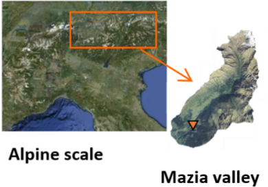

```{r setup, include=FALSE}
knitr::opts_chunk$set(eval = TRUE)
library(geotopbricks)
```

## Who am I?

- Environmental engineer with hydraulic and hydrological background (more deterministic and physicall-based than statics!)
- Some skills in programming and a R entusiast which I use to work with hydro-climatic data. 
- Find me as @ecor on GitHub 
- I'm self-employed and freelancer as www.rendena100.eu .  
- Author of several R-packages and p


## Who are the other authors?

- Hydrologist ,,, BLA 
- Author of several packages, including `geotop`,...


## Hydrology

Scientific study of the movement, distribution, and quality of water on Earth water cycle, water resources and environmental watershed sustainability.

<!-- \hspace*{-1cm}\includegraphics[width=1\paperwidth]{resources/images/geotop_draw.png} -->
{width=50%}

## Soil Water Balance 

## GEOtop Hydrological Model

GEOtop is an  integrated hydrological model that simulates:
\begin{itemize}
\item water flow in the soil $\,\to\,$ Richards' eq (sub) + Kinematic eq (sur)
\item energy exchange with the atmosphere $\,\to\,$ full integration of equation
\end{itemize}

{width=20%}
{width=20%}
{width=20%}


## Hydrological Model


- Input: meteo data, elevations, soil parameters
- Output: snow cover, soil temperature, soil moisture

{width=90%}
## GEOtop model}%{Optional Subtitle

Water and energy budgets can be activated :

- one or the other $\,\to\,$ simplification
- both them together $\,\to\,$ realistic

Two setup configurations :
- __1D__: only vertical fluxes $\,\to\,$ mass and energy balance at local scale (only in one soil column)
- __3D__: vertical and lateral fluxes $\,\to\,$ balances at basin scale

{width=90%}


Core components of GEOtop software packages are: 

- written in C/C++
- released in 2014 (version 2.0) as free open-source project, a re-engineering process is going to finish (version 3.0); 
- scientifically tested and published;
- documented on GitHub repository: *http://geotopmodel.github.io/geotop/*

{width=90%}
<!-- \begin{center} -->
<!-- Scientific quality of the project but still missing \\ -->
<!-- a \textbf{modern software engineering approach!} -->
<!-- \end{center} -->

<!-- % mettere,se ci sta, anche il grafico con i papers pubblicati “20 years of dev …” -->

## GEOtop external extensions 

__Lorem ipsum__ dolor sit amet, consectetur adipiscing elit, sed do eiusmod tempor incididunt ut labore et dolore magna aliqua. Ut enim ad minim veniam, quis nostrud exercitation ullamco laboris nisi ut aliquip ex ea commodo consequat. Duis aute irure dolor in reprehenderit in voluptate velit esse cillum dolore eu fugiat nulla pariatur. Excepteur sint occaecat cupidatat non proident, sunt in culpa qui officia deserunt mollit anim id est laborum


## GEOtop 

placeholder

## GEOtop configuration File (geotop.inpts)

placeholder


## GEOtop configuration File (geotop.inpts)

A GEOtop simulation is organized in a set of files within a directory.
This directory contains: 

-**input files** (meteorological forcings,
topography, land-use, soil-type maps, initial conditions); **target
information** (which results are requested) ; 
- **observations**. 
Allthese information are written in a file called `geotop.inpts`, which is
a list of **keyword-value** pairs:


```
InitDateDDMMYYYYhhmm    =   09/04/2014 18:00  
EndDateDDMMYYYYhhmm     =   01/01/2016 00:00 
[...] 
MeteoFile               =   "meteoB2_irr" 
PointOutputFile         =   "tabs/point" 
```

## Simulation of soil water budget in an alpine site


GOtop is applied to estimate soil water content in two soil columns below  two hydro-meteorological stations (B2 and P2) located in Val Mazia/Match, Malles Venosta/Mals Vinschgau, in South Tyrol, Italy (LOng Term Reasearch Ecological Area, [http://lter.eurac.edu/en]).
  
 {width=40%} 
<!--CHANGE THE FIGUE !!! -->


## Geotopbricks Graph
<!-- # ```{r,fig.height=8, fig.width=6,echo=FALSE,results="hide",collapse=TRUE,warning=FALSE,message=FALSE} -->

```{r,echo=FALSE,results="hide",collapse=TRUE,warning=FALSE,message=FALSE}
#!/usr/bin/env Rscript
# file appendSmetData.R
#
# This script creates a graph of the package function and thair main external depencies
#
# author: Emanuele Cordano on 09-09-2015

#This program is free software: you can redistribute it and/or modify
#it under the terms of the GNU General Public License as published by
#the Free Software Foundation, either version 3 of the License, or
#(at your option) any later version.
#
#This program is distributed in the hope that it will be useful,
#but WITHOUT ANY WARRANTY; without even the implied warranty of
#MERCHANTABILITY or FITNESS FOR A PARTICULAR PURPOSE.  See the
#GNU General Public License for more details.
#
#You should have received a copy of the GNU General Public License
#along with this program.  If not, see <http://www.gnu.org/licenses/>.

###############################################################################
##rm(list=ls())
library(igraph)
set.seed(123)
list_envs <- list(environment(rasterFromOutput2DMap),
                  environment(writeLines),
                  environment(read.table),environment(terrain))
names(list_envs) <- c("geotopbricks","base","utils","raster")
color <- c("green","blue","orange","yellow") ###,"white","brown")
names(color) <- names(list_envs)

list_names <- lapply(X=list_envs,FUN=function(x){ls(env=x)})
list_df <- list()

for (it in names(list_envs)) {
	
		list_df[[it]]	<- data.frame(funx=list_names[[it]],env=it,color=color[it],stringsAsFactors=FALSE)
	
	
}
df <- do.call(what=rbind,args=list_df)

##### SEMPLIFICATE DF

onlyfun <- list(hydroGOF=c("gof"),hydroPSO=c("hydroPSO","lhoat"),geotopbricks=c("declared.geotop.inpts.keywords","rasterFromOutput2DMap","brickFromOutputSoil3DTensor","get.geotop.inpts.keyword.value"),
		base=c("writeLines","readLines"),utils=c("read.table"),raster=c("brick","raster","stack")) ### read.table was removed

for (it in names(onlyfun)) {
	
	cond  <- ((df$env==it) & (df$funx %in% onlyfun[[it]])) | (df$env!=it)
	df    <- df[cond,]
	
	
}		


fun_names <- df$funx
		

names(fun_names) <- fun_names

########################################
########################################
########################################
########################################
########################################
lfunx <- lapply(X=fun_names,FUN=function(x,nx) {
			o <- try(get(x),silent=TRUE)
			
			if (class(o)=="try-error") {
				
				o <- NA ### "It looks like a method!"
				return(o)
				
			}
			o <- formals(o)
		
			o <- lapply(X=o,FUN=as.character)
			
			o <- unlist(o)
			
			
			o <- o[o %in% nx]
			
			src <-  as.character(body(x))
			src <-  unlist(str_split(src, boundary("word")))
			nx <-  src[src %in% nx]
		
			o <- c(o,nx)
			o <- unique(o)
			
			
			
			
			return(o)
		
		},nx=fun_names)


for (it in names(lfunx)) {
	
	temp <- lfunx[[it]]
	ii <- which(temp!=it)
	temp <- temp[ii]
	nl <- length(temp)
	lfunx[[it]] <- array(c(rep(it,nl),temp),c(nl,2))
	
}
#####edges
edges <- do.call(rbind,lfunx)
vertices <- unique(edges)
#####
env_base <- "base;utils"
df$env[df$env=="base"]  <- env_base
df$env[df$env=="utils"] <- env_base
df$color[df$env==env_base] <- "white"
#####
color_ <- df$color
env_   <- df$env
names(color_) <- df$funx
names(env_) <- df$funx
######
gg <- graph_from_edgelist(edges)
vnames <- V(gg)$name
V(gg)$color <- color_[vnames]
vcodes <- sprintf("%02d",1:length(vnames))
names(vcodes) <- vnames
V(gg)$name <- vcodes
main <- "geotopOptim2  Internal Functions"
plot(gg,main=main)
legend("bottomleft",legend=unique(env_),fill=unique(color_),ncol=2)
legend("topleft",legend=paste(vcodes,vnames,sep=" : "),ncol=3,cex=0.6)
#pp <- png::readPNG('resources/images/geotopoptim_v2.png')
#xleft <- 1
#xright <- xleft+ncol(pp)-1
#ybottom = 0
#ytop= ybottom+nrow(pp)-1
#rasterImage(pp, xleft=xleft, ybottom=ybottom,xright=xright,ytop=ytop, angle = 0, interpolate = FALSE)

```


## Simulation of soil water budget in an alpine site

Here is the directory containing files of B2 point simulation: 
```{r,echo=TRUE,return=FALSE}
library(geotopbricks) 

## SET GEOTOP WORKING DIRECTORY
wpath_B2 <- "resources/simulation/Matsch_B2_Ref_007" 
##writeLines(list.files(wpath_B2))
```

## Getting simulation input data

Meteorological variable time series are imported and saved as 'meteo' variable (class 'zoo'). This variable is retrieved through the GEOtop keyword  __MeteoFile__ : 

```{r,echo=TRUE,return=TRUE}
tz <- "Etc/GMT-1"
meteo <- get.geotop.inpts.keyword.value(
  "MeteoFile",
  wpath=wpath_B2,
  data.frame=TRUE,
  tz=tz)
class(meteo)
```

## Verifying that import of simulation input data has succeed 

Meteorological time series once imported are available in the R environment:
```{r,echo=TRUE,return=TRUE}
head(meteo[12:14,c("Iprec","WindSp","WindDir")])
head(meteo[12:14,c("RelHum","AirT","Swglobal")])
```

## Plotting 

```{r,echo=TRUE,return=TRUE}
library(ggplot2)

```

## Getting output simulation data

Soil Water Content Profile: 
```{r,echo=TRUE,return=FALSE}
tz <- "Etc/GMT-1"
SWC_B2  <- get.geotop.inpts.keyword.value(
  "SoilLiqContentProfileFile",
  wpath = wpath_B2,
  data.frame = TRUE,
  date_field = "Date12.DDMMYYYYhhmm.",
  tz = tz,
  zlayer.formatter = "z%04d"
)
help(get.geotop.inpts.keyword.value) ## for more details!
```

## P2 

The same for P2:
```{r,echo=TRUE,return=FALSE}
wpath_P2 <- "resources/simulation/Matsch_P2_Ref_007" 
SWC_P2  <- get.geotop.inpts.keyword.value(
  "SoilLiqContentProfileFile",
  wpath = wpath_P2,
  data.frame = TRUE,
  date_field = "Date12.DDMMYYYYhhmm.",
  tz = "Etc/GMT-1",
  zlayer.formatter = "z%04d")
  

```

## Data Reformatting

```{r,echo=TRUE}
class(SWC_B2)
```

```{r,echo=TRUE}
SWC_B2 <- cbind(time=index(SWC_B2),as.data.frame(SWC_B2))
class(SWC_B2)
names(SWC_B2)
###knitr::kable(head(SWC_B2))
```


## Stuff

Hydrological models are solvers of the differantial equations of water flows and water thermodymanics in the Earth associated to heat transfers between Earth and the low atmosphere. They are a simplification of a real-world system
useful to understand, predict, manage water resources. 
”integrated”


<!-- ## {.plain} -->
<!-- \hspace*{-1cm}\includegraphics[width=1\paperwidth]{IMAGE} -->


## Computation

LOREM IPSUM:

- getting your data in the right shape (e.g. `tidyverse`, `recipes`)

-  getting your data in the right shape (e.g. `tidyverse`, `recipes`)

- lorem ipsum


## Interested?

www.geotop.org
<!-- \begin{minipage}[c]{0.5\textwidth} -->
<!-- \includegraphics[width=0.9\textwidth]{img/SDCR.jpg}  -->
<!-- \end{minipage} -->
<!-- \begin{minipage}[c]{0.5\textwidth} -->
<!-- \begin{block}{SDCR} -->
<!-- M. van der Loo and E. de Jonge (2018) -->
<!-- \emph{Statistical Data Cleaning with applications in R} -->
<!-- Wiley, Inc. -->
<!-- \end{block} -->
<!-- \begin{block}{validatetools} -->
<!-- \begin{itemize} -->
<!-- \item Available on \href{https://CRAN.R-project.org/package=validatetools}{\underline{CRAN}} -->
<!-- \end{itemize} -->
<!-- \end{block} -->
<!-- \begin{block}{More theory?} -->
<!-- $\leftarrow$ See book  -->
<!-- \end{block} -->
<!-- \end{minipage} -->

Thank you for your attention! / Merci pour votre attention!  


## Addendum

LOREM IPSUM

